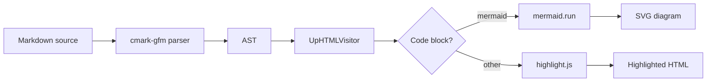
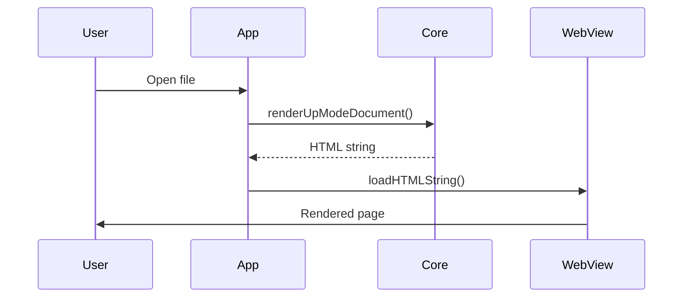
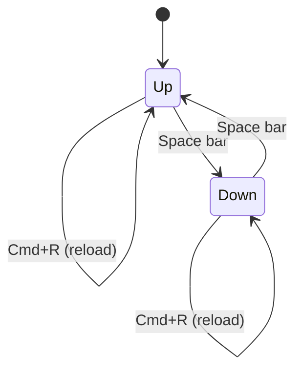

Feature showcase
===============================================================================

Mud renders GitHub-Flavoured Markdown with a set of extended features beyond
the CommonMark baseline. This document demonstrates all of them in one place.


-------------------------------------------------------------------------------


## Alerts

GFM alert syntax (`> [!TYPE]`) produces colour-coded call-outs with Octicon
icons.

> [!NOTE]
> Highlights information that users should take into account, even when
> skimming.

> [!TIP]
> Optional information to help a user be more successful.

> [!IMPORTANT]
> Crucial information necessary for users to succeed.

> [!WARNING]
> Critical content demanding immediate user attention due to
> potential risks.

> [!CAUTION]
> Negative potential consequences of an action.

Alerts can also contain rich content — code blocks, lists, inline formatting,
and links:

> [!TIP]
> Press **Space** to toggle between Up mode (rendered) and Down mode
> (raw source) without losing your scroll position.
>
> Or use the toolbar button, or **View → Toggle Mode** in the menu bar.


## Diagrams

Fenced code blocks with `mermaid` as the language identifier are rendered as
diagrams using the Mermaid library.


### Rendering pipeline




### Request lifecycle




### Mode states




## Syntax highlighting

Code blocks with a language tag are highlighted server-side by highlight.js via
JavaScriptCore — no network requests, no external dependencies.

```swift
struct Renderer {
    func render(_ markdown: String) -> String {
        let doc = MarkdownParser.parse(markdown)
        var visitor = UpHTMLVisitor()
        visitor.visit(doc)
        return visitor.result
    }
}
```

```python
from pathlib import Path

def render_file(path: Path) -> str:
    text = path.read_text(encoding="utf-8")
    return markdown.markdown(text, extensions=["tables", "fenced_code"])
```

```sh
mud -u README.md > output.html
mud -u -b README.md        # open in browser
mud -f README.md           # fragment only, no <html> wrapper
```


## Tables

GFM tables support per-column text alignment using `:` in the separator row.

| Feature          | Syntax               | Status |
| ---------------- | :------------------: | -----: |
| Alerts           | `> [!NOTE]`          | ✓      |
| Mermaid diagrams | ```` ```mermaid ```` | ✓      |
| Syntax highlight | ```` ```swift ````   | ✓      |
| Emoji shortcodes | `:shortcode:`        | ✓      |
| Task lists       | `- [ ]`              | ✓      |
| Strikethrough    | `~~text~~`           | ✓      |
| DocC asides      | `> Note: …`          | ✓      |
| Status asides    | `> Status: …`        | ✓      |


## Task lists

- [x] CommonMark baseline (headings, lists, links, images)
- [x] GFM tables
- [x] GFM task lists
- [x] GFM strikethrough
- [x] GFM alerts (note, tip, important, warning, caution)
- [x] DocC asides
- [x] Status asides
- [x] Mermaid diagrams
- [x] Syntax highlighting via highlight.js
- [x] Emoji shortcodes
- [ ] Math rendering (not yet planned)


## Inline formatting

Standard inline markup: **bold**, _italic_, _**bold and italic**_,
~~strikethrough~~, and `inline code`.

Emoji shortcodes resolve to Unicode using GitHub's gemoji database (~1,800
aliases): :rocket: :sparkles: :tada: :white_check_mark: :warning:

> "Mud renders Markdown the way GitHub does, right on your Mac."


## DocC asides

DocC-style asides use a word-and-colon prefix instead of the GFM `[!TYPE]` tag.
Both syntaxes produce the same icon and colour scheme.

> Note: Use DocC style in documentation comments rendered by Xcode.

> Tip: The TOC sidebar (View → Show Sidebar) lists all headings. Click any
> entry to jump to that section.

> Warning: Modifying the file outside Mud while it is open may cause the file
> watcher to miss the final change event on some filesystems.


## Status asides

A blockquote starting with `Status:` renders as a special call-out — used in
plan documents to track progress.

> Status: Complete
>
> All features in this document are implemented and shipping.
