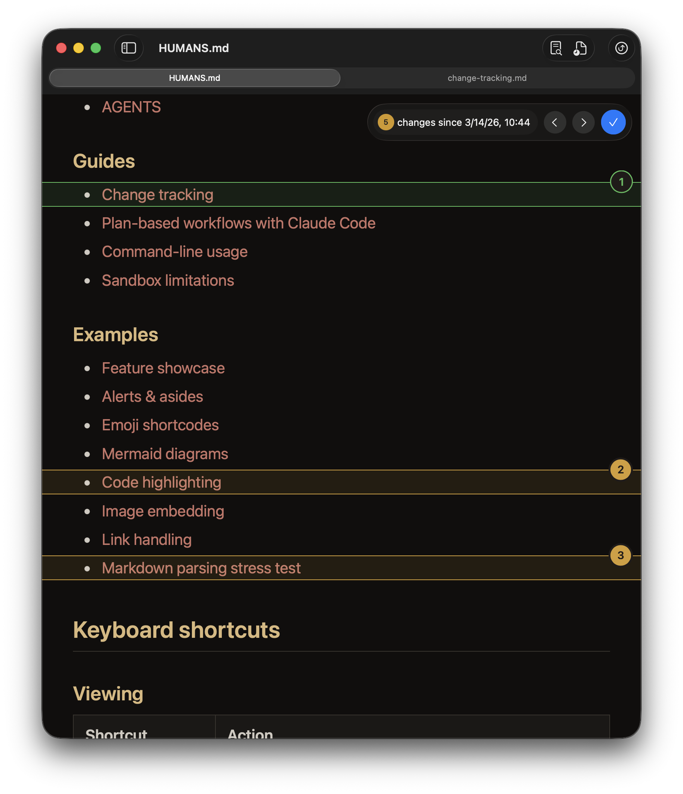
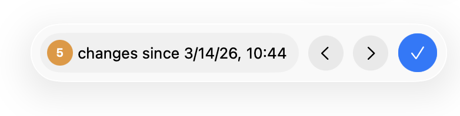
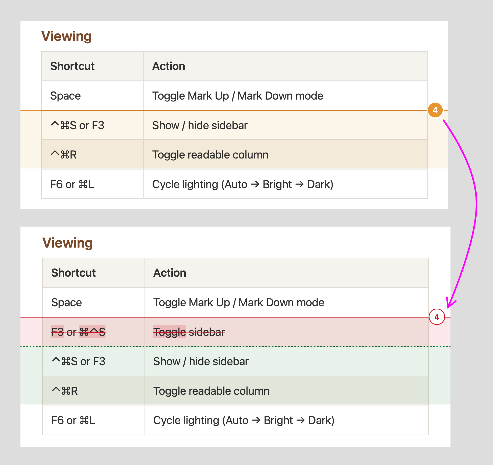
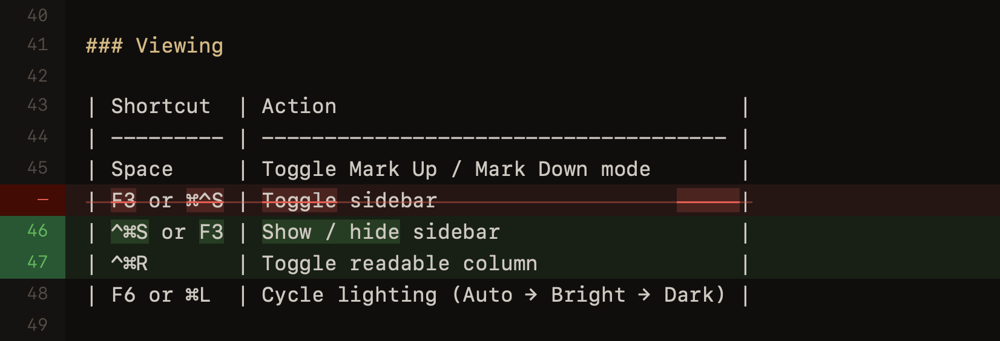
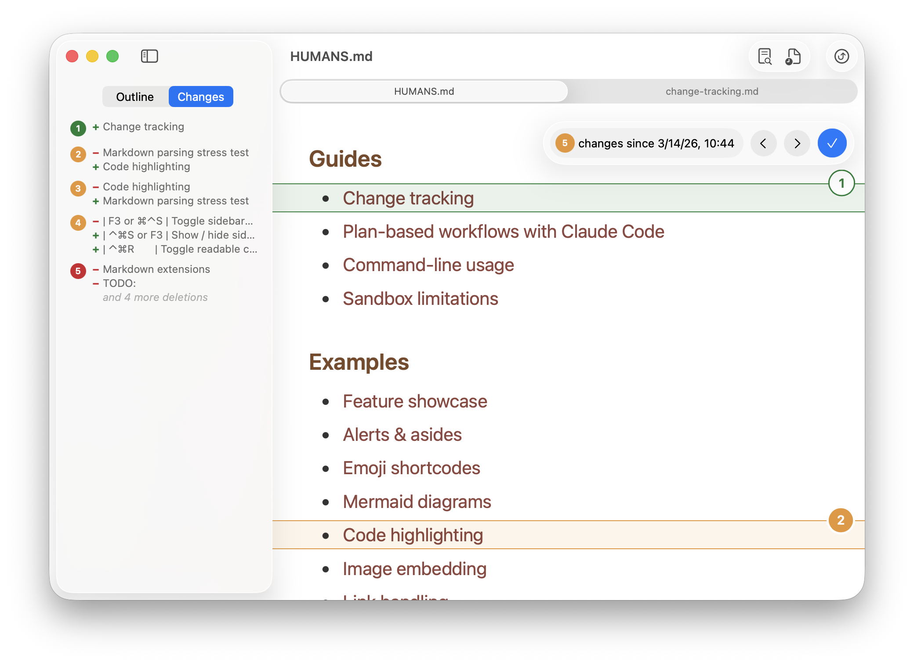
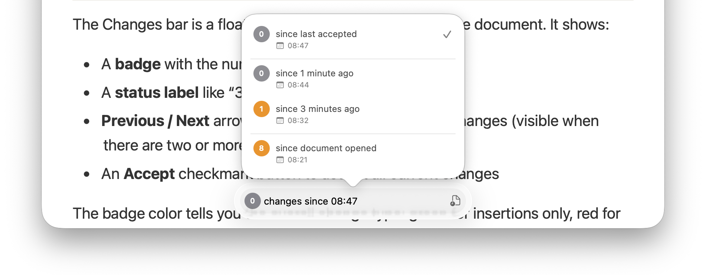
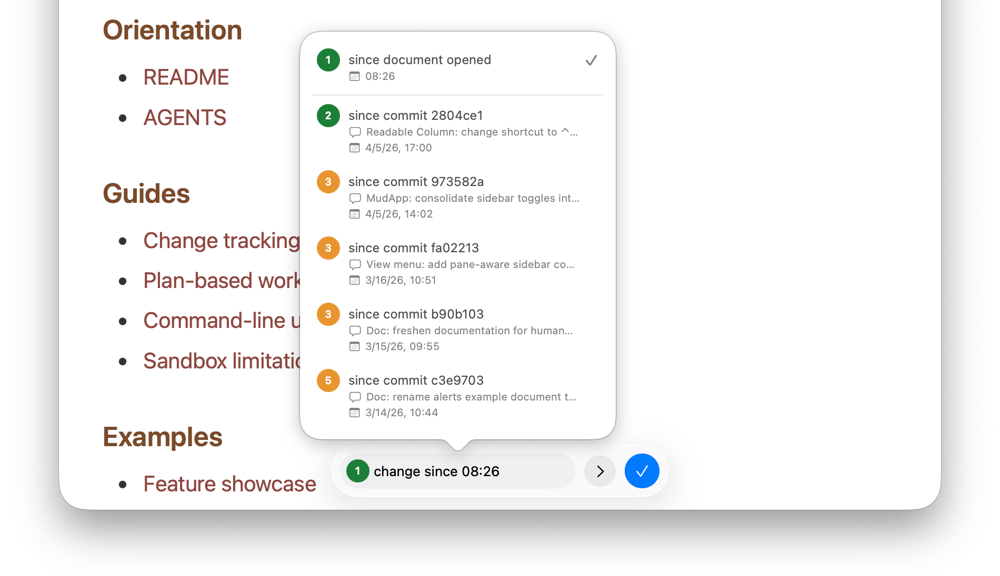

Change tracking
===============================================================================

Mud can track changes to your Markdown documents as you edit them. When change
tracking is on, Mud highlights insertions, deletions, and modifications in both
Up and Down modes — down to the word level.

## Turning it on

Change tracking is on by default. You can toggle it from the **View** menu:

- **View → Show Changes** (⌃⌘C) to show the Changes bar
- **View → Hide Changes** (⌃⌘C) to hide it

You can also click the **Changes** button in the toolbar (the clock-badge
icon).

## The Changes bar

The Changes bar is a floating capsule that appears over the document. It shows:

- A **badge** with the number of change groups
- A **status label** like "3 changes since 10:19am"
- **Previous / Next** arrow buttons to navigate between changes (visible when
  there are two or more change groups)
- An **Accept** checkmark button to accept all current changes

The badge color tells you the overall change type: green for insertions only,
red for deletions only, orange for a mix of both.

## How changes appear

### Up mode

In Up mode, changes appear as tinted overlays on the rendered document. Each
change group has a numbered **expando button** in the top-right corner of the
overlay.

- **Green overlays** mark inserted content. These are always expanded.
- **Red overlays** mark deleted content. Click the expando button to reveal the
  deleted text with a strikethrough.
- **Orange overlays** mark mixed changes (a deletion replaced by an insertion).
  Click the expando button to expand the group and see separate green/red
  sub-overlays for each part.

When a mixed group is expanded, word-level diffs highlight exactly which words
changed within each line.

### Down mode

In Down mode, changes appear as colored line-number gutters and background
tints on the raw source:

- **Green line numbers** mark inserted lines
- **Red line numbers** with a strikethrough mark deleted lines
- Word-level markers highlight the specific words that changed within each line

## The Changes sidebar

Open the sidebar (⌃⌘S) and switch to the **Changes** tab to see a list of all
change groups. Each row shows:

- A numbered badge matching the overlay in the document
- A summary of the changes in that group (e.g., "+ Added a new paragraph", "−
  Removed the old heading")

Click a row to scroll to that change in the document and highlight it. Click
the same row again to deselect it.

## Choosing a waypoint

By default, Mud diffs against the state when you last accepted changes — or
when the document was opened, if you haven't accepted yet. You can choose a
different waypoint by clicking the status label area on the Changes bar to open
the **Changes since…** popover.

The popover shows all available waypoint:

- **Since last accepted** — the most recent accept point
- **Time-based snapshots** — automatic snapshots taken as you reload (e.g.,
  "since 1 minute ago", "since 5 minutes ago")
- **Since document opened** — the content at the moment the file was first
  loaded

Select any waypoint to see what has changed since that point. The active
waypoint has a checkmark next to it.

## Accepting changes

Click the **checkmark** button on the Changes bar to accept all current
changes. This creates a new waypoint from the current content — the change
count resets to zero, and future edits will be compared against this new
accepted state.

Accepting is lightweight and local. It doesn't modify the file on disk — it
just moves the comparison point forward.

## Git commits

> Note: Git commits are available in the direct distribution build only.

When this option is enabled in Settings, the **Changes since…** popover gains
a **Git** section at the bottom. This lets you diff against:

- **Since last staged** — the version in the git index (shown only when there
  are unstaged changes)
- **Recent commits** — up to five commits that touched this file, with the
  short hash and commit message

This is a powerful way to review what you've changed since your last commit, or
to compare against any recent point in the file's history.

## Positioning the floating bars

The Changes bar (and Find bar) can be placed at three positions:

- **Top right** (default)
- **Bottom right**
- **Bottom center**

Change this in **Settings → General → Floating controls position**.

## Keyboard shortcuts

| Shortcut | Action              |
| -------- | ------------------- |
| ⌃⌘C      | Show / hide changes |
| ⌃⌘S      | Show / hide sidebar |
