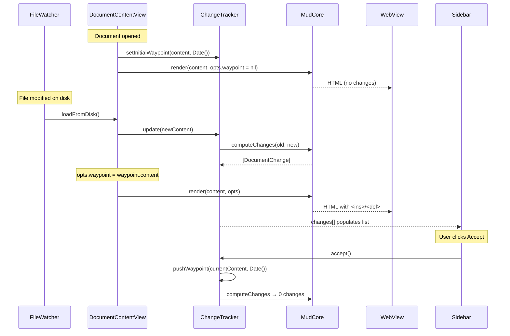

Plan: Track Changes
===============================================================================

> Status: Planning


## Overview

Add a change-tracking feature to Mud. When a document is opened, its content is
snapshot as a "waypoint". On each subsequent reload (file change), the current
content is word-diffed against the waypoint, and `<ins>`/ `<del>` elements are
injected into the rendered HTML (both Up and Down modes). A new sidebar pane
lists each change; selecting one scrolls to and highlights it. Deletions are
hidden unless selected.


## Concepts

**Waypoint** — a snapshot of the document content at a point in time, plus a
timestamp. Created automatically when the document is first opened, and
manually when the user clicks "Accept". Old waypoints are retained in memory
for a future waypoint-selector UI.

**Change** — a discrete insertion, deletion, or modification identified by the
diff engine. Each change has a unique ID that appears as a `data-change-id`
attribute in the HTML and as an entry in the sidebar list.

**Accept** — creates a new waypoint from the current content. The diff is
recomputed against the new waypoint (producing zero changes until the next file
modification).


## Data flow

The waypoint is an optional render option. When `RenderOptions.waypoint` is
set, MudCore computes the diff and injects change markers. When nil (the
default), rendering proceeds exactly as today. Print and Open in Browser build
their `RenderOptions` without a waypoint, so exported HTML never contains
change markers.




## Architecture

### Layer 1: Diff engine (MudCore)

The diff engine lives in MudCore because it needs AST access and integrates
with rendering. It has no UI dependencies.

**Leveraging `ParsedMarkdown` :** MudCore already has a `ParsedMarkdown` struct
(from the title-extraction work) that parses once and stores the `Document`
AST, headings, and source text. The diff engine works with `ParsedMarkdown`
values directly — `BlockMatcher` takes two `ParsedMarkdown` inputs and walks
their pre-parsed ASTs. No redundant parsing.

**New files in `Core/Sources/Core/Diff/` :**

- `WordDiff.swift` — tokenise text into words, run diff, produce `[DiffToken]`.
  Uses Swift's `CollectionDifference` on word arrays (which uses Myers
  internally). A `DiffToken` is either `.unchanged(String)`,
  `.inserted(String)`, or `.deleted(String)`.

- `BlockMatcher.swift` — given two `ParsedMarkdown` values (old and new), match
  leaf blocks between their ASTs by content fingerprint. Produces a
  `[BlockMatch]` list: each entry is `.matched(old, new)`, `.inserted(new)`, or
  `.deleted(old)`. Uses content hashing via `CollectionDifference`.

- `DiffContext.swift` — the bridge between diffing and rendering. Built from
  `BlockMatcher` output + per-block `WordDiff` results. Provides:

  - `annotation(for: Markup) -> BlockAnnotation?` — looked up by source range
    during AST walking
  - `precedingDeletions(before: Markup) -> [RenderedDeletion]` — deleted blocks
    that should appear before a given node
  - `inlineAnnotations(for: Markup) -> [InlineAnnotation]` — word-level
    `<ins>`/ `<del>` positions within a modified block

  The `DiffContext` is an optional input to the rendering functions. When
  `nil`, rendering proceeds exactly as today (zero overhead for the common
  case).

- `ChangeList.swift` — extracts a flat `[DocumentChange]` array from the
  `DiffContext` for the sidebar. Each `DocumentChange` carries:

  - `id: String` (matches `data-change-id` in HTML)
  - `type: ChangeType` (.insertion, .deletion, .modification)
  - `summary: String` (first ~60 characters of changed content)
  - `sourceLine: Int` (for scroll targeting)


### Layer 2: Rendering integration (MudCore)

#### Up mode

`UpHTMLVisitor` gains an optional `diffContext: DiffContext?` field.

Block-level visit methods (`visitParagraph`, `visitHeading`, `visitCodeBlock`,
`visitBlockQuote`, `visitListItem`, etc.) call two new helper methods at entry
and exit:

```
emitChangeOpen(for: markup)   // at the top of each visit method
emitChangeClose(for: markup)  // at the bottom
```

These helpers:

1. Emit any **preceding deletions** — pre-rendered HTML from deleted blocks,
   wrapped in `<del class="mud-change mud-change-del" data-change-id="…">`.

2. For **inserted blocks**, wrap the entire block output in
   `<ins class="mud-change mud-change-ins" data-change-id="…">`.

3. For **modified blocks**, set a flag so that inline text emission
   (`visitText`) consults the word-level diff and wraps changed runs in
   `<ins>`/ `<del>` spans.

When `diffContext` is nil, these helpers are no-ops — the hot path is
unchanged.

To render deleted blocks for insertion into the current document, the diff
engine renders each deleted block in isolation using a separate `UpHTMLVisitor`
walk (without a `diffContext`, to avoid recursion).


#### Down mode

`DownHTMLVisitor.highlight()` gains an optional `diffContext: DiffContext?`
parameter.

Down mode operates on source lines, so the integration is more direct:

1. **Deleted lines** are re-inserted into the line array at their original
   positions, wrapped in `<del>` spans and styled distinctly (e.g. dimmed text,
   strikethrough).

2. **Inserted lines** get an `<ins>` wrapper around the line content.

3. **Modified lines** use the word-level diff to wrap changed words within the
   existing syntax-highlight spans.

Line numbers for deleted lines could show the old line number (dimmed) or be
blank — this is a UX detail to decide during implementation.


#### RenderOptions change

`RenderOptions` gains an optional waypoint field:

```swift
struct RenderOptions {
    // ... existing fields ...
    var waypoint: String?  // old content to diff against; nil = no tracking
}
```

`RenderOptions` is `Sendable + Equatable`. `String?` satisfies both.
(`ParsedMarkdown` won't — it holds a swift-markdown `Document` reference.)

When `waypoint` is non-nil, the render functions internally parse it, run block
matching + word diff → `DiffContext`, and pass it to the visitor.

The `contentIdentity` hash includes the waypoint so content changes when change
tracking is toggled. Since theme/zoom changes go through JS (without re-calling
the render function), the diff is only computed when content actually changes —
not on every visual update. Mode toggles (up ↔ down) do re-render, but the diff
cost is negligible for typical Markdown file sizes.


#### API changes

The existing render function signatures are unchanged — they already accept
`RenderOptions`, which now carries the waypoint. One new function:

```swift
// Compute sidebar change list from two ParsedMarkdown values
MudCore.computeChanges(
    old: ParsedMarkdown, new: ParsedMarkdown
) -> [DocumentChange]
```

This is called by `ChangeTracker` when content changes, independently of
rendering. It works directly with pre-parsed ASTs — no redundant parsing. The
render functions also compute the diff internally (re-parsing the waypoint
string), but this is negligible for typical file sizes.


### Layer 3: State management (App)

**New file: `App/ChangeTracker.swift`**

```swift
class ChangeTracker: ObservableObject {
    @Published private(set) var waypoints: [Waypoint] = []
    @Published private(set) var changes: [DocumentChange] = []
    @Published var selectedChangeID: String?

    /// The raw content of the active waypoint (for RenderOptions).
    var activeWaypointContent: String? {
        waypoints.last?.parsed.markdown
    }

    /// The timestamp of the active waypoint (for sidebar display).
    var activeWaypointTimestamp: Date? {
        waypoints.last?.timestamp
    }

    func setInitialWaypoint(_ parsed: ParsedMarkdown)
    func update(_ currentParsed: ParsedMarkdown)  // recomputes changes
    func accept(_ currentParsed: ParsedMarkdown)   // pushes new waypoint
}

struct Waypoint: Identifiable {
    let id: UUID
    let parsed: ParsedMarkdown  // pre-parsed; AST reused for diffing
    let timestamp: Date
}
```

`ChangeTracker` stores waypoints as `ParsedMarkdown` values so the AST is
parsed once per waypoint and reused for every subsequent diff.

`ChangeTracker` is a per-window `ObservableObject`. `DocumentState` gains a
`let changeTracker = ChangeTracker()` field (same pattern as
`let find = FindState()`).

Waypoints are in-memory only. They do not persist across closing and re-opening
the document. Old waypoints are retained in the `waypoints` array for a future
waypoint-selector UI but are not otherwise used.

**Integration with `DocumentContentView` :**

- `loadFromDisk()` already creates a `ParsedMarkdown` value (from the
  title-extraction work). After setting `content = .parsed(parsed)`, it calls
  `changeTracker.update(parsed)`. On first load this creates the initial
  waypoint; on subsequent loads it diffs against the active waypoint via
  `MudCore.computeChanges(old:new:)` and updates `changes`.
- The `renderOptions` computed property sets
  `opts.waypoint = changeTracker.activeWaypointContent` when the content
  differs from the waypoint (i.e. there are changes to show). When content
  matches the waypoint, `opts.waypoint` stays nil (no markers needed).
- The existing content-identity mechanism handles WebView reloads — since
  `contentIdentity` includes the waypoint, enabling/disabling change tracking
  naturally triggers a re-render.


### Layer 4: Sidebar UI (App)

**`App/SidebarView.swift`** and **`App/ChangesSidebarView.swift`** are already
implemented. `SidebarView` wraps a segmented Outline/Changes picker with
`OutlineSidebarView` and `ChangesSidebarView` as panes.
`DocumentWindowController.setupContent()` already wires `SidebarView` in place
of the old direct `OutlineSidebarView`.

`ChangesSidebarView` currently shows a static "No Changes" empty state. It
needs to be extended to accept a `ChangeTracker` and display:

1. **Status line** at the top: "X changes since HH:MM" (or "today at HH:MM",
   "yesterday", etc.) with an **Accept** button.

2. **Change list** — each row shows:

   - An icon: `plus.circle` (insertion), `minus.circle` (deletion), or
     `pencil.circle` (modification), coloured green/red/blue
   - A one-line summary of the changed text
   - Tapping a row sets `changeTracker.selectedChangeID` and triggers a
     scroll-to-change action

3. **Empty state** — when no changes: "No changes since HH:MM".


### Layer 5: WebView and JavaScript (App + Resources)

**Scroll-to-change:**

Add `Mud.scrollToChange(id)` in `mud.js`:

```javascript
Mud.scrollToChange = function(id) {
    const el = document.querySelector('[data-change-id="' + id + '"]');
    if (!el) return;
    el.scrollIntoView({ behavior: 'smooth', block: 'center' });
    el.classList.add('mud-change-active');
    // Remove active class after 2s
    setTimeout(() => el.classList.remove('mud-change-active'), 2000);
};
```

**Deletion reveal:**

Deletions are hidden by default via CSS:

```css
.mud-change-del { display: none; }
.mud-change-del.mud-change-revealed { display: block; }
```

When a deletion is selected in the sidebar, JS reveals it:

```javascript
Mud.revealChange = function(id) {
    document.querySelectorAll('.mud-change-revealed')
        .forEach(el => el.classList.remove('mud-change-revealed'));
    const el = document.querySelector('[data-change-id="' + id + '"]');
    if (el) el.classList.add('mud-change-revealed');
};
```

When the selection is cleared (or moves to a non-deletion), all revealed
deletions are hidden again.

**Scroll target extension:**

`DocumentState.scrollTarget` currently only supports headings. We need a
parallel mechanism for changes. Options:

1. Add a `ScrollTarget.change(id: String)` variant
2. Use a separate `@Published var changeScrollTarget: String?`

Option 2 is simpler and avoids modifying the existing `ScrollTarget` type.
`WebView.updateNSView()` would check this property and call
`Mud.scrollToChange(id)` / `Mud.revealChange(id)` via JS.


### Layer 6: CSS (Resources)

**New file: `Resources/mud-changes.css`** (or additions to `mud.css`)

```css
/* Change markers */
.mud-change-ins {
    background-color: var(--change-ins-bg);
    border-left: 3px solid var(--change-ins-border);
    padding-left: 4px;
}

.mud-change-del {
    display: none;
}

.mud-change-del.mud-change-revealed {
    display: block;
    background-color: var(--change-del-bg);
    border-left: 3px solid var(--change-del-border);
    padding-left: 4px;
    opacity: 0.7;
    text-decoration: line-through;
}

.mud-change-active {
    outline: 2px solid var(--change-active-border);
    outline-offset: 2px;
}

/* Inline word-level changes */
ins.mud-word { background-color: var(--change-ins-word-bg); text-decoration: none; }
del.mud-word { background-color: var(--change-del-word-bg); text-decoration: line-through; }
```

Theme files gain `--change-*` CSS variables so change colours harmonise with
each theme.


## Key design decisions (resolved)

1. **Block matching strategy** — LCS on block fingerprints via Swift's
   `CollectionDifference`. Handles adds/removes/reorders well. Fuzzy matching
   for modified blocks can be added later.

2. **Block granularity** — Leaf blocks (individual list items, table rows,
   blockquote paragraphs), not top-level containers. Finer diffs, more precise
   sidebar entries.

3. **Diff computation** — Synchronous. Markdown files are typically small.
   Profile during implementation and move to async if needed.

4. **Deleted line numbers in Down mode** — Show a dash (`–`) in the line number
   column, styled with the deletion colour.

5. **Sidebar pane state** — Per-window (`@State` in `SidebarView`), not
   persisted.


## Concerns to resolve

### Word-level diffs across inline formatting in Up mode

Block-level change tracking is straightforward: wrap entire blocks in `<ins>`/
`<del>`. But for **modified blocks**, the plan calls for word-level `<ins>`/
`<del>` injection during the `UpHTMLVisitor` walk. This is the hardest part of
the feature because change boundaries don't respect inline formatting
boundaries.

Consider a paragraph changing from `This is **important** and relevant` to
`This is **critical** and relevant`. The word diff identifies
`important → critical`, but in the AST, "important" lives inside a `Strong`
node. The visitor processes it via a separate `visitText` call nested inside
`visitStrong`. To inject `<del>important</del><ins>critical</ins>` correctly,
the visitor must:

1. **Track a character offset** across multiple `visitText` calls within a
   single paragraph (since the word diff operates on the paragraph's plain
   text, not individual AST nodes).

2. **Split text emission** at change boundaries — when a `visitText` call
   covers text that is partly unchanged and partly changed, it must emit the
   unchanged portion, open an `<ins>` or `<del>`, emit the changed portion, and
   close it.

3. **Handle cross-boundary changes** — when a change spans from one inline node
   into another (e.g., from plain text into emphasis, or across a link
   boundary), `<ins>`/ `<del>` elements must be closed before the formatting
   boundary and reopened after it, to produce valid HTML.

This needs its own detailed design before implementation. Possible approach:

- Before visiting a modified paragraph's children, pre-compute a list of
  `InlineEdit` records: each carries a character-offset range (relative to the
  paragraph's full plain text) and a type (insertion/deletion).
- Maintain a running character offset as `visitText` calls accumulate.
- In `visitText`, check whether the current text overlaps any `InlineEdit`
  ranges. If so, split the text at the edit boundaries and wrap the affected
  segments.
- If an edit range extends beyond the current `visitText` call, close the
  `<ins>`/ `<del>` at the end and set a flag to reopen it in the next
  `visitText` call.

This keeps the complexity contained within `visitText` and a small amount of
per-paragraph state, without touching other visit methods. But it needs careful
testing with edge cases: changes inside code spans, changes spanning emphasis
boundaries, changes at the start/end of inline nodes, adjacent changes, and
overlapping formatting.


## Implementation sequence

1. ~~**Sidebar UI** — `SidebarView` container, segmented control, placeholder
   `ChangesSidebarView` .~~ _Done._

2. **Diff engine** — `WordDiff`, `BlockMatcher`, `DiffContext`, `ChangeList` in
   MudCore. Unit-testable in isolation.

3. **Up mode integration** — `UpHTMLVisitor` changes, `DiffContext` threading
   through `renderUpModeDocument`. Verify with snapshot tests.

4. **Down mode integration** — `DownHTMLVisitor` changes. Similar snapshot
   tests.

5. **ChangeTracker + RenderOptions** — state management in App layer, waypoint
   field on `RenderOptions`. Wire to `DocumentContentView.loadFromDisk()`.

6. **CSS** — change marker styles, theme variable additions.

7. **Sidebar UI (changes pane)** — flesh out `ChangesSidebarView` with change
   list, status line, Accept button.

8. **JS + WebView** — `scrollToChange`, `revealChange`, wire to sidebar
   selection.

9. **Polish** — keyboard shortcuts (Next Change / Previous Change), menu items,
   edge cases (empty document, binary files, very large diffs).


## Resolved questions

- **Undo Accept?** — No. Old waypoints are retained in memory for a future
  waypoint-selector UI, which will provide this capability. No stop-gap undo
  needed.
- **Keyboard shortcuts?** — Deferred. May add shortcuts for Accept,
  Next/Previous Change later.
- **Persist waypoints?** — No. In-memory only. Closing the document discards
  all waypoints.
- **Print / Open in Browser?** — Build `RenderOptions` without a waypoint. No
  change markers in exported HTML.
- **Global disable toggle?** — Deferred. May add a "Change Tracking" settings
  pane in the future for this and other related preferences.
