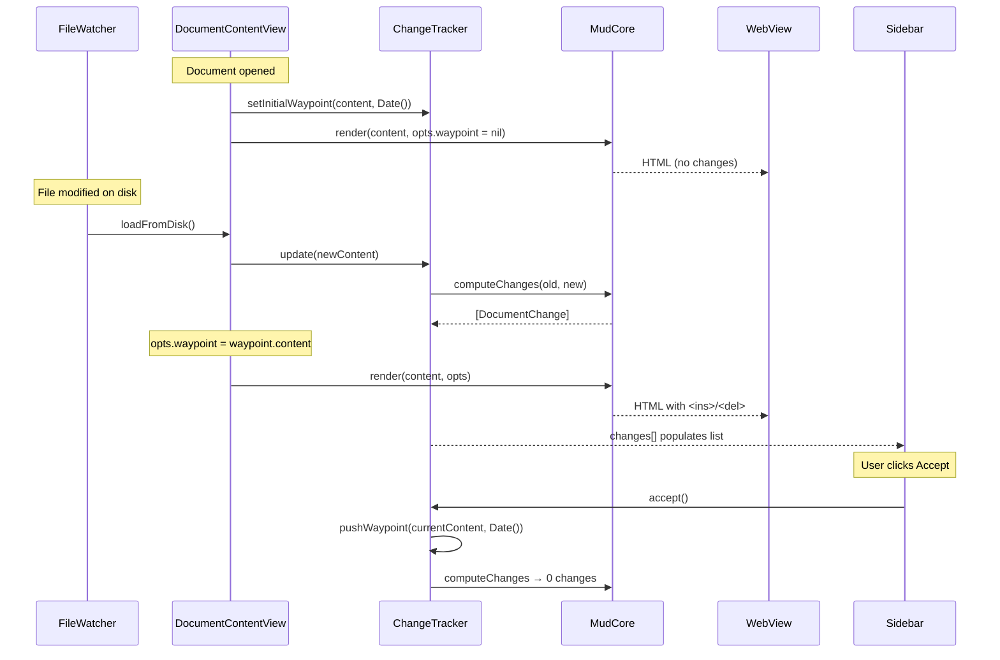

Plan: Track Changes
===============================================================================

> Status: Planning


## Overview

Add a change-tracking feature to Mud. When a document is opened, its content is
snapshot as a "waypoint". On each subsequent reload (file change), the current
content is diffed against the waypoint at the block level and `<ins>`/ `<del>`
elements are injected into the rendered HTML (both Up and Down modes). A new
sidebar pane lists each change; selecting one scrolls to and highlights it.
Deletions are hidden unless selected.


## Concepts

**Waypoint** — a snapshot of the document content at a point in time, plus a
timestamp. Created automatically when the document is first opened, and
manually when the user clicks "Accept". Old waypoints are retained in memory
for a future waypoint-selector UI.

**Change** — a discrete insertion, deletion, or modification identified by the
diff engine. Each change has a unique ID that appears as a `data-change-id`
attribute in the HTML and as an entry in the sidebar list.

**Accept** — creates a new waypoint from the current content. The diff is
recomputed against the new waypoint (producing zero changes until the next file
modification).


## Data flow

The waypoint is an optional render option. When `RenderOptions.waypoint` is
set, MudCore computes the diff and injects change markers. When nil (the
default), rendering proceeds exactly as today. Print and Open in Browser build
their `RenderOptions` without a waypoint, so exported HTML never contains
change markers.




## Architecture

### Layer 1: Diff engine (MudCore) — implemented

Implemented in `Core/Sources/Core/Diff/`. Works with `ParsedMarkdown` values
directly (pre-parsed ASTs, no redundant parsing).

**`BlockMatcher.swift`** — `BlockMatcher.match(old:new:) -> [BlockMatch]`. Two
phases:

1. **Fingerprint matching.** `LeafBlockCollector` (a `MarkupWalker`) flattens
   each AST into leaf blocks: paragraphs, headings, code blocks, list items,
   table head/rows, blockquote paragraphs, thematic breaks, HTML blocks. Nested
   lists are handled specially — the item's own paragraph becomes a leaf, then
   inner list items become separate leaves. Each block carries its source text
   as the fingerprint (not plain text — formatting-only changes like `text` →
   `**text**` are detected). `CollectionDifference` on the fingerprint arrays
   identifies unchanged, inserted, and removed blocks.

2. **Modification detection.** Gap-based pairing: unchanged blocks serve as
   anchors, and the gaps between them contain removals and insertions. Within
   each gap, removals pair with insertions from the end (closest to the next
   anchor). Excess removals become deletions at the front of the gap; excess
   insertions become insertions at the end.

Output is a `[BlockMatch]` list: `.unchanged(old, new)`, `.modified(old, new)`,
`.inserted(new)`, or `.deleted(old)`. Each `LeafBlock` carries the AST node,
source text, fingerprint, and 1-based source line.

**`DiffContext.swift`** — `DiffContext(old:new:)` runs `BlockMatcher`
internally and builds lookup tables keyed by `SourceKey` (line/column range).
API:

- `annotation(for: Markup) -> BlockAnnotation?` — returns `.inserted` or
  `.modified` for changed blocks, `nil` for unchanged. Never returns `.deleted`
  (deleted blocks don't exist in the new AST).
- `changeID(for: Markup) -> String?` — deterministic IDs (`"change-1"`,
  `"change-2"`, ...) for `data-change-id` attributes.
- `precedingDeletions(before: Markup) -> [RenderedDeletion]` — deleted and
  modified-old blocks that should appear before a given node, pre-rendered as
  HTML via a separate `UpHTMLVisitor` walk.
- `trailingDeletions() -> [RenderedDeletion]` — deletions after the last
  surviving block (or all deletions when new document is empty).

`RenderedDeletion` carries `.html`, `.changeID`, `.summary`, and
`.isModificationOld` (so `ChangeList` can count a modification as one sidebar
entry, not two).

The `DiffContext` is an optional input to the rendering functions. When `nil`,
rendering proceeds exactly as today (zero overhead for the common case).

**`ChangeList.swift`** — `ChangeList.computeChanges(old:new:)` walks
`DiffContext` and leaf blocks to produce a `[DocumentChange]` array for the
sidebar. Filters out `isModificationOld` deletions. Each `DocumentChange`
carries `id`, `type` (.insertion/.deletion/.modification), `summary` (~60
chars, word-boundary truncation), and `sourceLine` (for scroll targeting;
deletions use the following block's line).


### Layer 2: Rendering integration (MudCore)

#### Up mode — implemented

`UpHTMLVisitor` has an optional `diffContext: DiffContext?` field. When set,
`MudCore.renderUpToHTML` creates a `DiffContext(old: waypoint, new: parsed)`
and assigns it before the walk. After the walk, `emitTrailingDeletions()` is
called.

Two private helpers, `emitChangeOpen(for:)` and `emitChangeClose(for:)`,
bracket leaf-block visit methods: `visitParagraph`, `visitHeading`,
`visitCodeBlock`, `visitListItem`, `visitHTMLBlock`, `visitThematicBreak`.
Container visit methods (`visitBlockQuote`, `visitOrderedList`,
`visitUnorderedList`, `visitTable`) are not wrapped — their leaf children
receive markers instead.

`emitChangeOpen`:

1. Emits **preceding deletions** — pre-rendered HTML wrapped in
   `<del class="mud-change mud-change-del" data-change-id="…">`. This includes
   the old version of modified blocks.
2. For **inserted** or **modified** blocks, opens an `<ins>` wrapper
   (`mud-change-ins` or `mud-change-mod`).

`emitChangeClose`: closes the `</ins>` if the node was annotated.

Both are no-ops when `diffContext` is nil — the hot path is unchanged.

Deleted and modified-old blocks are pre-rendered by `DiffContext` via a
separate `UpHTMLVisitor` walk (without a `diffContext`, to avoid recursion).

**Not yet wrapped:** `visitTableRow` and `visitTableHead` — these are leaf
blocks per `LeafBlockCollector` but lack change markers in the visitor. To be
added when table change-tracking is needed.


#### Down mode — implemented

Down mode is line-based, not AST-based. `DownHTMLVisitor` is a stateless
`Sendable` struct (stored as `static let`), so unlike `UpHTMLVisitor` it cannot
carry a mutable `diffContext` field.

**`LineDiffMap`** (`Core/Sources/Core/Diff/LineDiffMap.swift`) bridges
block-level diff data to line-level rendering. Built from
`BlockMatcher.match()` results, it maps block source ranges to line ranges:

- `annotation(forLine:) -> LineAnnotation?` — returns a `LineAnnotation`
  (carrying `changeID`) for new-document lines within an inserted or modified
  block. Returns `nil` for unchanged lines. Both insertions and modifications
  use the same annotation (the old-version lines appear as a `DeletionGroup`
  immediately before).
- `deletionGroups: [DeletionGroup]` — old-document line ranges to interleave,
  each with `beforeNewLine` (position), `oldLineRange`, and `changeID`.
  Trailing deletions use `Int.max`.

**Integration:** `DownHTMLVisitor.highlight()` was refactored to extract Phases
1+2 into `highlightLines()` (returning a `HighlightResult`). A new
`highlightWithChanges(new:old:matches:)` method highlights both documents,
builds a `LineDiffMap`, and calls `buildLayoutWithChanges()` — a variant of the
Phase 3 layout that interleaves deletion groups and adds CSS classes.
`MudCore.renderDownToHTML` branches on `options.waypoint`.

**HTML structure** — CSS classes on existing `<div class="dl">` rows, not
`<ins>`/ `<del>` wrappers (avoids conflicts with syntax-highlighting spans):

```html
<!-- Unchanged -->
<div class="dl"><span class="ln">1</span><span class="lc">…</span></div>
<!-- Inserted or modified (new version) -->
<div class="dl dl-ins" data-change-id="change-1"><span class="ln">3</span><span class="lc">…</span></div>
<!-- Deleted (re-inserted from old doc, syntax-highlighted) -->
<div class="dl dl-del" data-change-id="change-2"><span class="ln">–</span><span class="lc">…</span></div>
```

Deleted lines get `md-*` syntax-highlight spans (the old markdown is
highlighted via `DownHTMLVisitor` and rendered line content is extracted). Line
numbers show an en dash (`–`) for deleted lines.


#### RenderOptions and ParsedMarkdown changes — implemented

`RenderOptions.waypoint: ParsedMarkdown?` — when set, the render function
creates a `DiffContext` and injects change markers. When nil (the default),
rendering is unchanged.

`ParsedMarkdown` gained `@unchecked Sendable` (justified: immutable struct,
`RawMarkup` has no mutation API) and `Equatable` (by source string comparison).
Both conformances live in `ParsedMarkdown.swift`.

`contentIdentity` includes `String(waypoint.markdown.hashValue)` so content
changes when the waypoint changes (e.g. Accept). Theme/zoom changes go through
JS without re-calling the render function, so the diff is only computed when
content actually changes.


#### API changes

The existing render function signatures are unchanged — they already accept
`RenderOptions`, which now carries the waypoint. One new function:

```swift
// Compute sidebar change list from two ParsedMarkdown values
MudCore.computeChanges(
    old: ParsedMarkdown, new: ParsedMarkdown
) -> [DocumentChange]
```

This is called by `ChangeTracker` when content changes, independently of
rendering. Both paths (rendering and sidebar) work with pre-parsed ASTs — no
redundant parsing anywhere.


### Layer 3: State management (App)

**New file: `App/ChangeTracker.swift`**

```swift
class ChangeTracker: ObservableObject {
    @Published private(set) var waypoints: [Waypoint] = []
    @Published private(set) var changes: [DocumentChange] = []
    @Published var selectedChangeID: String?

    /// The active waypoint's ParsedMarkdown (for RenderOptions).
    var activeWaypoint: ParsedMarkdown? {
        waypoints.last?.parsed
    }

    /// The timestamp of the active waypoint (for sidebar display).
    var activeWaypointTimestamp: Date? {
        waypoints.last?.timestamp
    }

    func setInitialWaypoint(_ parsed: ParsedMarkdown)
    func update(_ currentParsed: ParsedMarkdown)  // recomputes changes
    func accept(_ currentParsed: ParsedMarkdown)   // pushes new waypoint
}

struct Waypoint: Identifiable {
    let id: UUID
    let parsed: ParsedMarkdown  // pre-parsed; AST reused for diffing
    let timestamp: Date
}
```

`ParsedMarkdown` is parsed once per waypoint. The same value flows to
`RenderOptions.waypoint` (for rendering) and to
`MudCore.computeChanges(old:new:)` (for the sidebar). No re-parsing anywhere.

`ChangeTracker` is a per-window `ObservableObject`. `DocumentState` gains a
`let changeTracker = ChangeTracker()` field (same pattern as
`let find = FindState()`). `DocumentContentView` observes it directly via
`@ObservedObject var changeTracker: ChangeTracker` — passed separately, not
accessed through `state.changeTracker`. (SwiftUI does not observe nested
`ObservableObject` fields automatically, so this follows the same pattern used
for `FindState`.)

Waypoints are in-memory only. They do not persist across closing and re-opening
the document. Old waypoints are retained in the `waypoints` array for a future
waypoint-selector UI but are not otherwise used.

**Integration with `DocumentContentView` :**

- `loadFromDisk()` already creates a `ParsedMarkdown` value (from the
  title-extraction work). After setting `content = .parsed(parsed)`, it calls
  `changeTracker.update(parsed)`. On first load this creates the initial
  waypoint; on subsequent loads it diffs against the active waypoint via
  `MudCore.computeChanges(old:new:)` and updates `changes`.
- The `renderOptions` computed property sets
  `opts.waypoint = changeTracker.activeWaypoint` when the content differs from
  the waypoint (i.e. there are changes to show). When content matches the
  waypoint, `opts.waypoint` stays nil (no markers needed).
- The existing content-identity mechanism handles WebView reloads — since
  `contentIdentity` includes the waypoint, enabling/disabling change tracking
  naturally triggers a re-render.


### Layer 4: Sidebar UI (App)

**`App/SidebarView.swift`** and **`App/ChangesSidebarView.swift`** are already
implemented. `SidebarView` wraps a segmented Outline/Changes picker with
`OutlineSidebarView` and `ChangesSidebarView` as panes.
`DocumentWindowController.setupContent()` already wires `SidebarView` in place
of the old direct `OutlineSidebarView`.

`ChangesSidebarView` currently shows a static "No Changes" empty state. It
needs to be extended to accept a `ChangeTracker` and display:

1. **Status line** at the top: "X changes since HH:MM" (or "today at HH:MM",
   "yesterday", etc.) with an **Accept** button.

2. **Change list** — each row shows:

   - An icon: `plus.circle` (insertion), `minus.circle` (deletion), or
     `pencil.circle` (modification), coloured green/red/blue
   - A one-line summary of the changed text
   - Tapping a row sets `changeTracker.selectedChangeID` and triggers a
     scroll-to-change action

3. **Empty state** — when no changes: "No changes since HH:MM".


### Layer 5: WebView and JavaScript (App + Resources)

**Scroll-to-change:**

Add `Mud.scrollToChange(id)` in `mud.js`:

```javascript
Mud.scrollToChange = function(id) {
    const el = document.querySelector('[data-change-id="' + id + '"]');
    if (!el) return;
    el.scrollIntoView({ behavior: 'smooth', block: 'center' });
    el.classList.add('mud-change-active');
    // Remove active class after 2s
    setTimeout(() => el.classList.remove('mud-change-active'), 2000);
};
```

**Deletion reveal:**

Deletions are hidden by default via CSS:

```css
.mud-change-del { display: none; }
.mud-change-del.mud-change-revealed { display: block; }
```

When a deletion is selected in the sidebar, JS reveals it:

```javascript
Mud.revealChange = function(id) {
    document.querySelectorAll('.mud-change-revealed')
        .forEach(el => el.classList.remove('mud-change-revealed'));
    const el = document.querySelector('[data-change-id="' + id + '"]');
    if (el) el.classList.add('mud-change-revealed');
};
```

When the selection is cleared (or moves to a non-deletion), all revealed
deletions are hidden again.

**Scroll target extension:**

`DocumentState.scrollTarget` currently only supports headings. We need a
parallel mechanism for changes. Options:

1. Add a `ScrollTarget.change(id: String)` variant
2. Use a separate `@Published var changeScrollTarget: String?`

Option 2 is simpler and avoids modifying the existing `ScrollTarget` type.
`WebView.updateNSView()` would check this property and call
`Mud.scrollToChange(id)` / `Mud.revealChange(id)` via JS.


### Layer 6: CSS (Resources)

**New file: `Resources/mud-changes.css`** (or additions to `mud.css`)

```css
/* Block-level change markers */
.mud-change-ins,
.mud-change-mod {
    background-color: var(--change-ins-bg);
    border-left: 3px solid var(--change-ins-border);
    padding-left: 4px;
}

.mud-change-del {
    display: none;
}

.mud-change-del.mud-change-revealed {
    display: block;
    background-color: var(--change-del-bg);
    border-left: 3px solid var(--change-del-border);
    padding-left: 4px;
    opacity: 0.7;
    text-decoration: line-through;
}

.mud-change-active {
    outline: 2px solid var(--change-active-border);
    outline-offset: 2px;
}
```

Theme files gain `--change-*` CSS variables so change colours harmonise with
each theme.


## Key design decisions (resolved)

1. **Block matching strategy** — LCS on block fingerprints via Swift's
   `CollectionDifference`. Handles adds/removes/reorders well. Fuzzy matching
   for modified blocks can be added later.

2. **Block granularity** — Leaf blocks (individual list items, table rows,
   blockquote paragraphs), not top-level containers. Finer diffs, more precise
   sidebar entries.

3. **Diff computation** — Synchronous. Markdown files are typically small.
   Profile during implementation and move to async if needed.

4. **Deleted line numbers in Down mode** — Show a dash (`–`) in the line number
   column, styled with the deletion colour.

5. **Sidebar pane state** — Per-window (`@State` in `SidebarView`), not
   persisted.

6. **Diff granularity** — Block-level only for the initial implementation
   (Approach A). See the section below for the full analysis and evolution
   path.


## Diff granularity approaches

Three approaches for how changes are presented in the rendered document,
ordered from simplest to most precise. We implement **Approach A** first and
may evolve to **B** later. **C** is documented for completeness.


### Approach A: Block-level only (the `git diff` model) — ACTIVE

Modifications are treated as a deletion of the old block followed by an
insertion of the new block. No word-level diffing. This is how `git diff`
presents modified lines: old line in red, new line in green.

**In Up mode:** for a modified paragraph, the old version is rendered as a
hidden `<del>` block (revealable via the sidebar), and the new version is
rendered normally inside an `<ins>` wrapper with a "modified" visual indicator.

**In Down mode:** for a modified line, the old line is re-inserted as a hidden
`<del>` row, and the new line gets an `<ins>` wrapper.

**Pros:**

- Simplest to implement — no `WordDiff` engine, no inline marker injection, no
  cross-boundary concerns
- Always readable, even for heavily rewritten prose
- Matches the `git diff` mental model developers are used to

**Cons:**

- A single typo fix in a 200-word paragraph shows the entire paragraph as
  modified (old + new). The sidebar tells you which paragraph changed, but you
  must visually compare the two versions to spot the difference.


### Approach B: Block-level with word highlights (enhanced `git diff`)

Same structure as A — modifications are shown as old block (hidden) + new block
(visible). But within each version, changed words get a subtle background
highlight: insertions in the new block, deletions in the old block.

Crucially, this is **not interleaved**. The new version only has insertion
marks. The old version only has deletion marks. Each version reads as natural
prose with a bit of colour.

**Implementation (deferred):**

- Add `WordDiff.swift` to `Core/Sources/Core/Diff/` — tokenise text into words,
  diff via `CollectionDifference`, produce `[DiffToken]`.
- `DiffContext` gains `wordAnnotations(for: Markup) -> [WordAnnotation]` —
  character-offset ranges within a block's plain text.
- In `UpHTMLVisitor`, when rendering a modified block (old or new version),
  `visitText` consults word annotations and wraps changed runs in
  `<mark class="mud-word-ins">` or `<mark class="mud-word-del">`.
- The cross-boundary problem (a highlight spanning from plain text into
  emphasis) still exists but is less severe than Approach C because each
  version has only one type of mark — no interleaving of `<ins>` and `<del>`.
  The approach: close the `<mark>` before the formatting boundary and reopen it
  after. Only `visitText` needs modification.

**CSS additions for B:**

```css
mark.mud-word-ins { background-color: var(--change-ins-word-bg); }
mark.mud-word-del { background-color: var(--change-del-word-bg); }
```

**Pros:**

- Same readability as A for large changes
- Precise highlighting for small changes (typo fixes, number edits)
- Each version still reads as natural prose

**Cons:**

- Requires `WordDiff` engine
- Cross-boundary `<mark>` handling needed in `visitText` (simpler than C but
  still non-trivial)


### Approach C: Inline word-level (the `--word-diff` model)

Interleaved `<ins>` and `<del>` elements within the text of modified blocks.
The old text is deleted inline and the new text is inserted inline, producing
output like: `This is <del>important</del><ins>critical</ins> and relevant`.

**Implementation (not planned):**

- Same `WordDiff` engine as Approach B.

- `DiffContext` provides `InlineAnnotation` records with character-offset
  ranges and types (insertion/deletion).

- `UpHTMLVisitor.visitText` must:

  1. Track a running character offset across calls within a paragraph.
  2. Split text emission at change boundaries.
  3. Close `<ins>`/ `<del>` before inline formatting boundaries and reopen
     after them, to produce valid HTML (e.g., when a change spans from plain
     text into `<strong>`).

- Substantial edge-case surface: changes inside code spans, changes spanning
  emphasis boundaries, adjacent changes, overlapping formatting.

**Pros:**

- Most precise — you see exactly what changed without comparing two versions
- Compact — no duplicate blocks

**Cons:**

- Least readable for prose. Interleaved markers break reading flow, even for
  unchanged text surrounding the change. Empirically, `git diff` (line-level)
  is consistently more readable than `git diff --word-diff` for prose edits.
- Hardest to implement. The cross-boundary problem requires careful state
  management in the visitor and extensive edge-case testing.
- Modifications cannot be hidden — they're inline in the text, not separate
  blocks.


## Implementation sequence

1. ~~**Sidebar UI** — `SidebarView` container, segmented control, placeholder
   `ChangesSidebarView` .~~ _Done._

2. ~~**Diff engine** — `BlockMatcher` , `DiffContext` , `ChangeList` in
   MudCore. Unit-testable in isolation. (`WordDiff` deferred to Approach B.)~~
   _Done._ Implemented in `Core/Sources/Core/Diff/`.
   `MudCore.computeChanges(old:new:)` is the public API.

3. ~~**Up mode integration** — `UpHTMLVisitor` changes, `DiffContext` threading
   through `renderUpModeDocument` .~~ _Done._ Table row markers deferred.

4. ~~**Down mode integration** — `DownHTMLVisitor` changes.~~ _Done._
   `LineDiffMap` bridges block matches to line ranges. `highlightWithChanges()`
   and `buildLayoutWithChanges()` added.

5. **ChangeTracker + RenderOptions** — state management in App layer, waypoint
   field on `RenderOptions`. Wire to `DocumentContentView.loadFromDisk()`.

6. **Sidebar UI (changes pane)** — flesh out `ChangesSidebarView` with change
   list, status line, Accept button.

7. **CSS** — change marker styles, theme variable additions.

8. **JS + WebView** — `scrollToChange`, `revealChange`, wire to sidebar
   selection.

9. **Polish** — keyboard shortcuts (Next Change / Previous Change), menu items,
   edge cases (empty document, binary files, very large diffs).


## Resolved questions

- **Undo Accept?** — No. Old waypoints are retained in memory for a future
  waypoint-selector UI, which will provide this capability. No stop-gap undo
  needed.
- **Keyboard shortcuts?** — Deferred. May add shortcuts for Accept,
  Next/Previous Change later.
- **Persist waypoints?** — No. In-memory only. Closing the document discards
  all waypoints.
- **Print / Open in Browser?** — Build `RenderOptions` without a waypoint. No
  change markers in exported HTML.
- **Global disable toggle?** — Deferred. May add a "Change Tracking" settings
  pane in the future for this and other related preferences.
