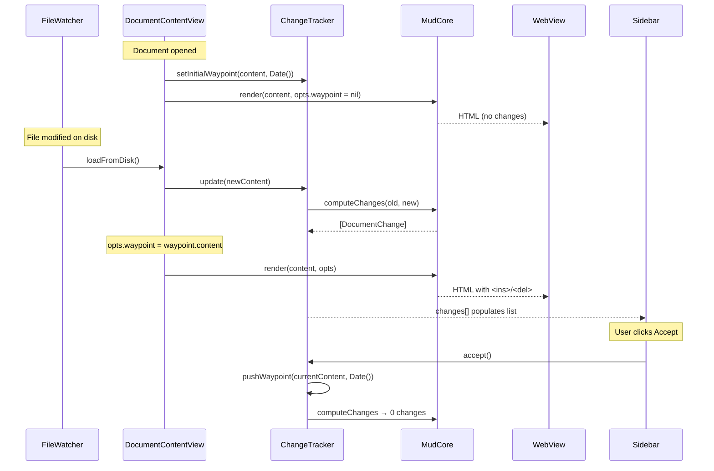

Plan: Track Changes
===============================================================================

> Status: Planning


## Overview

Add a change-tracking feature to Mud. When a document is opened, its content is
snapshot as a "waypoint". On each subsequent reload (file change), the current
content is word-diffed against the waypoint, and `<ins>`/ `<del>` elements are
injected into the rendered HTML (both Up and Down modes). A new sidebar pane
lists each change; selecting one scrolls to and highlights it. Deletions are
hidden unless selected.


## Concepts

**Waypoint** — a snapshot of the document content at a point in time, plus a
timestamp. Created automatically when the document is first opened, and
manually when the user clicks "Accept". Old waypoints are retained in memory
for a future waypoint-selector UI.

**Change** — a discrete insertion, deletion, or modification identified by the
diff engine. Each change has a unique ID that appears as a `data-change-id`
attribute in the HTML and as an entry in the sidebar list.

**Accept** — creates a new waypoint from the current content. The diff is
recomputed against the new waypoint (producing zero changes until the next file
modification).


## Data flow

The waypoint is an optional render option. When `RenderOptions.waypoint` is
set, MudCore computes the diff and injects change markers. When nil (the
default), rendering proceeds exactly as today. Print and Open in Browser build
their `RenderOptions` without a waypoint, so exported HTML never contains
change markers.




## Architecture

### Layer 1: Diff engine (MudCore)

The diff engine lives in MudCore because it needs AST access and integrates
with rendering. It has no UI dependencies.

**New files in `Core/Sources/Core/Diff/` :**

- `WordDiff.swift` — tokenise text into words, run diff, produce `[DiffToken]`.
  Uses Swift's `CollectionDifference` on word arrays (which uses Myers
  internally). A `DiffToken` is either `.unchanged(String)`,
  `.inserted(String)`, or `.deleted(String)`.

- `BlockMatcher.swift` — given two parsed ASTs (old and new), match blocks
  between them by type and content similarity. Produces a `[BlockMatch]` list:
  each entry is `.matched(old, new)`, `.inserted(new)`, or `.deleted(old)`.
  Uses content hashing for fast fingerprinting and falls back to similarity
  scoring for fuzzy matches.

- `DiffContext.swift` — the bridge between diffing and rendering. Built from
  `BlockMatcher` output + per-block `WordDiff` results. Provides:

  - `annotation(for: Markup) -> BlockAnnotation?` — looked up by source range
    during AST walking
  - `precedingDeletions(before: Markup) -> [RenderedDeletion]` — deleted blocks
    that should appear before a given node
  - `inlineAnnotations(for: Markup) -> [InlineAnnotation]` — word-level
    `<ins>`/ `<del>` positions within a modified block

  The `DiffContext` is an optional input to the rendering functions. When
  `nil`, rendering proceeds exactly as today (zero overhead for the common
  case).

- `ChangeList.swift` — extracts a flat `[DocumentChange]` array from the
  `DiffContext` for the sidebar. Each `DocumentChange` carries:

  - `id: String` (matches `data-change-id` in HTML)
  - `type: ChangeType` (.insertion, .deletion, .modification)
  - `summary: String` (first ~60 characters of changed content)
  - `sourceLine: Int` (for scroll targeting)


### Layer 2: Rendering integration (MudCore)

#### Up mode

`UpHTMLVisitor` gains an optional `diffContext: DiffContext?` field.

Block-level visit methods (`visitParagraph`, `visitHeading`, `visitCodeBlock`,
`visitBlockQuote`, `visitListItem`, etc.) call two new helper methods at entry
and exit:

```
emitChangeOpen(for: markup)   // at the top of each visit method
emitChangeClose(for: markup)  // at the bottom
```

These helpers:

1. Emit any **preceding deletions** — pre-rendered HTML from deleted blocks,
   wrapped in `<del class="mud-change mud-change-del" data-change-id="…">`.

2. For **inserted blocks**, wrap the entire block output in
   `<ins class="mud-change mud-change-ins" data-change-id="…">`.

3. For **modified blocks**, set a flag so that inline text emission
   (`visitText`) consults the word-level diff and wraps changed runs in
   `<ins>`/ `<del>` spans.

When `diffContext` is nil, these helpers are no-ops — the hot path is
unchanged.

To render deleted blocks for insertion into the current document, the diff
engine renders each deleted block in isolation using a separate `UpHTMLVisitor`
walk (without a `diffContext`, to avoid recursion).


#### Down mode

`DownHTMLVisitor.highlight()` gains an optional `diffContext: DiffContext?`
parameter.

Down mode operates on source lines, so the integration is more direct:

1. **Deleted lines** are re-inserted into the line array at their original
   positions, wrapped in `<del>` spans and styled distinctly (e.g. dimmed text,
   strikethrough).

2. **Inserted lines** get an `<ins>` wrapper around the line content.

3. **Modified lines** use the word-level diff to wrap changed words within the
   existing syntax-highlight spans.

Line numbers for deleted lines could show the old line number (dimmed) or be
blank — this is a UX detail to decide during implementation.


#### RenderOptions change

`RenderOptions` gains an optional waypoint field:

```swift
struct RenderOptions {
    // ... existing fields ...
    var waypoint: String?  // old content to diff against; nil = no tracking
}
```

When `waypoint` is non-nil, the render functions internally:

1. Parse both old (waypoint) and new markdown into ASTs
2. Run block matching + word diff → `DiffContext`
3. Pass `DiffContext` to the visitor, which injects change markers

The `contentIdentity` hash includes `waypoint` presence so content changes
when change tracking is toggled. Since theme/zoom changes go through JS
(without re-calling the render function), the diff is only computed when
content actually changes — not on every visual update.


#### API changes

The existing render function signatures are unchanged — they already accept
`RenderOptions`, which now carries the waypoint. One new function:

```swift
// Compute sidebar change list from two content strings
MudCore.computeChanges(old: String, new: String) -> [DocumentChange]
```

This is called by `ChangeTracker` when content changes, independently of
rendering. The diff is computed twice (once here, once during rendering) but
this is negligible for typical Markdown file sizes.


### Layer 3: State management (App)

**New file: `App/ChangeTracker.swift`**

```swift
class ChangeTracker: ObservableObject {
    @Published private(set) var waypoints: [Waypoint] = []
    @Published private(set) var changes: [DocumentChange] = []
    @Published var selectedChangeID: String?

    /// The content of the active waypoint (for RenderOptions).
    var activeWaypointContent: String? {
        waypoints.last?.content
    }

    /// The timestamp of the active waypoint (for sidebar display).
    var activeWaypointTimestamp: Date? {
        waypoints.last?.timestamp
    }

    func setInitialWaypoint(_ content: String)
    func update(_ currentContent: String)  // recomputes changes
    func accept(_ currentContent: String)  // pushes new waypoint
}

struct Waypoint: Identifiable {
    let id: UUID
    let content: String
    let timestamp: Date
}
```

`ChangeTracker` is a per-window `ObservableObject`. `DocumentState` gains a
`let changeTracker = ChangeTracker()` field (same pattern as
`let find = FindState()`).

Waypoints are in-memory only. They do not persist across closing and
re-opening the document. Old waypoints are retained in the `waypoints` array
for a future waypoint-selector UI but are not otherwise used.

**Integration with `DocumentContentView` :**

- `loadFromDisk()` calls `changeTracker.update(text)` after reading new
  content. On first load, this creates the initial waypoint. On subsequent
  loads, it calls `MudCore.computeChanges()` and updates `changes`.
- The `renderOptions` computed property sets
  `opts.waypoint = changeTracker.activeWaypointContent` when the content
  differs from the waypoint (i.e. there are changes to show). When content
  matches the waypoint, `opts.waypoint` stays nil (no markers needed).
- The existing content-identity mechanism handles WebView reloads — since
  `contentIdentity` includes the waypoint, enabling/disabling change
  tracking naturally triggers a re-render.


### Layer 4: Sidebar UI (App)

**New file: `App/SidebarView.swift`**

A container view that wraps both sidebar panes:

```
struct SidebarView: View {
    enum Pane { case outline, changes }

    @State private var pane: Pane = .outline
    @ObservedObject var state: DocumentState
    var onSelectHeading: (OutlineHeading) -> Void

    var body: some View {
        VStack(spacing: 0) {
            Picker("", selection: $pane) {
                Text("Outline").tag(Pane.outline)
                Text("Changes").tag(Pane.changes)
            }
            .pickerStyle(.segmented)
            .padding(8)

            switch pane {
            case .outline:
                OutlineSidebarView(state: state, onSelect: onSelectHeading)
            case .changes:
                ChangesSidebarView(changeTracker: state.changeTracker)
            }
        }
    }
}
```

`DocumentWindowController.setupContent()` replaces the direct
`OutlineSidebarView` with `SidebarView`.

**New file: `App/ChangesSidebarView.swift`**

Displays:

1. **Status line** at the top: "X changes since HH:MM" (or "today at HH:MM",
   "yesterday", etc.) with an **Accept** button.

2. **Change list** — each row shows:

   - An icon: `plus.circle` (insertion), `minus.circle` (deletion), or
     `pencil.circle` (modification), coloured green/red/blue
   - A one-line summary of the changed text
   - Tapping a row sets `changeTracker.selectedChangeID` and triggers a
     scroll-to-change action

3. **Empty state** — when no changes: "No changes since HH:MM".


### Layer 5: WebView and JavaScript (App + Resources)

**Scroll-to-change:**

Add `Mud.scrollToChange(id)` in `mud.js`:

```javascript
Mud.scrollToChange = function(id) {
    const el = document.querySelector('[data-change-id="' + id + '"]');
    if (!el) return;
    el.scrollIntoView({ behavior: 'smooth', block: 'center' });
    el.classList.add('mud-change-active');
    // Remove active class after 2s
    setTimeout(() => el.classList.remove('mud-change-active'), 2000);
};
```

**Deletion reveal:**

Deletions are hidden by default via CSS:

```css
.mud-change-del { display: none; }
.mud-change-del.mud-change-revealed { display: block; }
```

When a deletion is selected in the sidebar, JS reveals it:

```javascript
Mud.revealChange = function(id) {
    document.querySelectorAll('.mud-change-revealed')
        .forEach(el => el.classList.remove('mud-change-revealed'));
    const el = document.querySelector('[data-change-id="' + id + '"]');
    if (el) el.classList.add('mud-change-revealed');
};
```

When the selection is cleared (or moves to a non-deletion), all revealed
deletions are hidden again.

**Scroll target extension:**

`DocumentState.scrollTarget` currently only supports headings. We need a
parallel mechanism for changes. Options:

1. Add a `ScrollTarget.change(id: String)` variant
2. Use a separate `@Published var changeScrollTarget: String?`

Option 2 is simpler and avoids modifying the existing `ScrollTarget` type.
`WebView.updateNSView()` would check this property and call
`Mud.scrollToChange(id)` / `Mud.revealChange(id)` via JS.


### Layer 6: CSS (Resources)

**New file: `Resources/mud-changes.css`** (or additions to `mud.css`)

```css
/* Change markers */
.mud-change-ins {
    background-color: var(--change-ins-bg);
    border-left: 3px solid var(--change-ins-border);
    padding-left: 4px;
}

.mud-change-del {
    display: none;
}

.mud-change-del.mud-change-revealed {
    display: block;
    background-color: var(--change-del-bg);
    border-left: 3px solid var(--change-del-border);
    padding-left: 4px;
    opacity: 0.7;
    text-decoration: line-through;
}

.mud-change-active {
    outline: 2px solid var(--change-active-border);
    outline-offset: 2px;
}

/* Inline word-level changes */
ins.mud-word { background-color: var(--change-ins-word-bg); text-decoration: none; }
del.mud-word { background-color: var(--change-del-word-bg); text-decoration: line-through; }
```

Theme files gain `--change-*` CSS variables so change colours harmonise with
each theme.


## Key design decisions to resolve

### 1. Block matching strategy

The quality of the diff depends heavily on how well we match blocks between the
old and new ASTs.

**Option A — Positional + content hash.** Walk both ASTs in parallel, matching
by position first, then by content similarity for displaced blocks. Fast but
brittle when blocks are reordered.

**Option B — LCS on block fingerprints.** Compute a fingerprint (content hash)
for each top-level block, then run LCS/ `CollectionDifference` on the
fingerprint arrays. Handles reordering well. Doesn't match blocks whose content
changed significantly.

**Option C — Hybrid.** LCS on fingerprints first (catches moves and unchanged
blocks), then fuzzy-match remaining unmatched blocks by content similarity.

**Recommendation:** Start with **Option B** for the MVP. It's simple, handles
the common case (blocks added/removed/reordered) well, and
`CollectionDifference` is built into Swift. Fuzzy matching (Option C) can be
added later if needed.


### 2. Granularity of "block"

What constitutes a block for matching purposes?

- **Top-level blocks only** (paragraphs, headings, code blocks, block quotes,
  lists) — simpler, but a single word change in a long list shows the entire
  list as modified.
- **Leaf blocks** (individual list items, table rows, blockquote paragraphs) —
  finer granularity, better diffs, but more complex matching.

**Recommendation:** Match at the **leaf block** level. The AST already provides
this structure. It produces more useful diffs and more precise sidebar entries.


### 3. Where the diff is computed

- **Synchronous in `loadFromDisk()`** — simple, but could cause a perceptible
  pause on very large documents.
- **Async on a background queue** — non-blocking, but requires careful state
  management and a brief "computing changes…" state.

**Recommendation:** Start **synchronous**. Markdown files are typically small
(< 100 KB). Profile during implementation and move to async if needed.


### 4. Deleted line numbers in Down mode

When deleted lines are re-inserted into the Down mode display, what line
numbers should they show?

- **Old line number** (dimmed) — gives context about where the line was.
- **Blank / dash** — visually distinct, doesn't confuse current numbering.
- **No line number column** — simplest.

**Recommendation:** Show a **dash** (`–`) in the line number column, styled
with the deletion colour. This is visually clear without implying the line
exists at a current line number.


### 5. Sidebar pane state scope

Should the Outline/Changes pane selection be per-window or global?

- **Per-window** (`DocumentState`) — different documents can show different
  panes.
- **Global** (`AppState`) — switching affects all windows, consistent with how
  lighting/theme/view toggles work.

**Recommendation:** **Per-window** (`@State` in `SidebarView`). Unlike lighting
or theme, the pane selection is tied to the review state of a specific
document. Not persisted to UserDefaults.


## Implementation sequence

1. **Diff engine** — `WordDiff`, `BlockMatcher`, `DiffContext`, `ChangeList` in
   MudCore. Unit-testable in isolation.

2. **Up mode integration** — `UpHTMLVisitor` changes, `DiffContext` threading
   through `renderUpModeDocument`. Verify with snapshot tests.

3. **Down mode integration** — `DownHTMLVisitor` changes. Similar snapshot
   tests.

4. **ChangeTracker** — state management in App layer. Wire to
   `DocumentContentView.loadFromDisk()`.

5. **CSS** — change marker styles, theme variable additions.

6. **Sidebar UI** — `SidebarView` container, `ChangesSidebarView`, segmented
   control, change list.

7. **JS + WebView** — `scrollToChange`, `revealChange`, wire to sidebar
   selection.

8. **Polish** — keyboard shortcuts (Next Change / Previous Change), menu items,
   edge cases (empty document, binary files, very large diffs).


## Open questions

- Should "Accept" be undoable? (Undo would pop the waypoint stack and recompute
  the diff against the previous waypoint.)
- Should there be a keyboard shortcut for Accept? For Next/Previous Change?
- Should changes persist across app relaunch? (Probably not for MVP — the
  waypoint is the moment the document was opened.)
- How should the feature interact with Print / Open in Browser? (Probably strip
  change markers from exported HTML.)
- Should there be a global toggle to disable change tracking entirely? (Useful
  if the feature has performance impact on very large files.)
