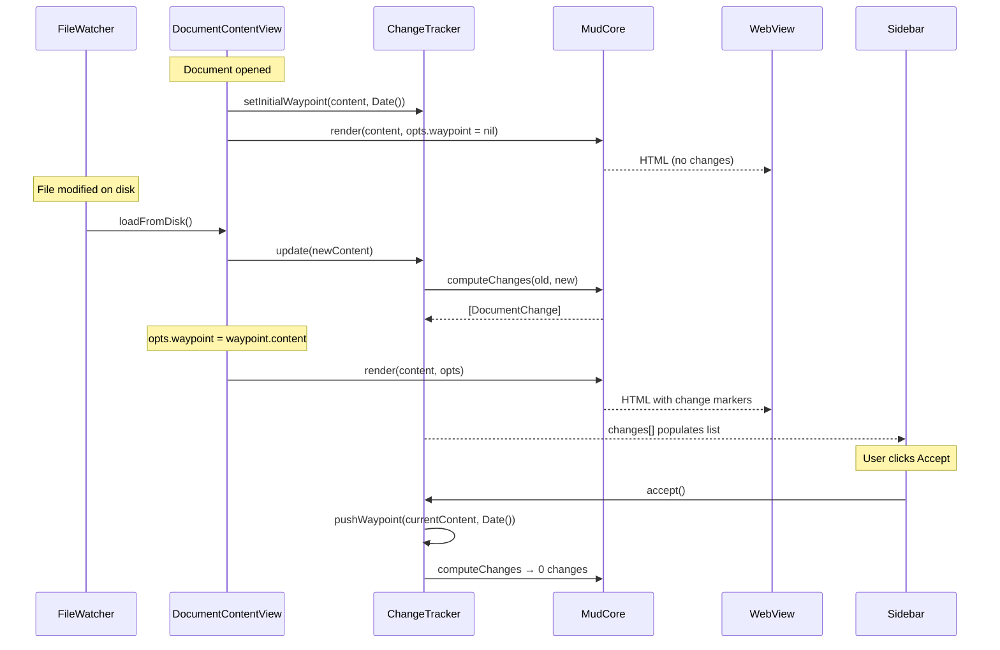

Plan: Track Changes
===============================================================================

> Status: Underway
>
> Current task: Step 9 - Polish…


## Overview

Add a change-tracking feature to Mud. When a document is opened, its content is
snapshot as a "waypoint". On each subsequent reload (file change), the current
content is diffed against the waypoint at the block level and change markers
are injected into the rendered HTML (both Up and Down modes). A new sidebar
pane lists each change; selecting one scrolls to and highlights it. Deletions
are hidden unless selected.


## Concepts

**Waypoint** — a snapshot of the document content at a point in time, plus a
timestamp. Created automatically when the document is first opened, and
manually when the user clicks "Accept". Old waypoints are retained in memory
for a future waypoint-selector UI.

**Change** — a discrete insertion or deletion identified by the diff engine.
Each change has a unique ID that appears as a `data-change-id` attribute in the
HTML and as an entry in the sidebar list. There is no separate "modification"
type — an edit to a paragraph produces a deletion (old version) and an
insertion (new version), grouped together in the sidebar.

**Change group** — consecutive changes with no unchanged block between them are
condensed into a single sidebar entry and a single visual overlay in Up mode.
Groups that contain both deletions and insertions are "mixed" (blue); pure
insertion groups are green; pure deletion groups are red. Grouping is computed
at diff time in `DiffContext` and carried through to rendering and the sidebar.

**Block pairing** — within a gap between unchanged anchors, deletions pair with
insertions by position (first deletion with first insertion, etc.). Paired
blocks get word-level diff highlighting; unpaired blocks show block-level
highlighting only.

**Accept** — creates a new waypoint from the current content. The diff is
recomputed against the new waypoint (producing zero changes until the next file
modification).


## Data flow

The waypoint is an optional render option. When `RenderOptions.waypoint` is
set, MudCore computes the diff and injects change markers. When nil (the
default), rendering proceeds exactly as today. Print and Open in Browser build
their `RenderOptions` without a waypoint, so exported HTML never contains
change markers.




## Architecture

### Layer 1: Diff engine (MudCore) — implemented

Implemented in `Core/Sources/Core/Diff/`. Works with `ParsedMarkdown` values
directly (pre-parsed ASTs, no redundant parsing).

**`BlockMatcher.swift`** — `BlockMatcher.match(old:new:) -> [BlockMatch]`.
Fingerprint matching via `CollectionDifference`:

`LeafBlockCollector` (a `MarkupWalker`) flattens each AST into leaf blocks:
paragraphs, headings, code blocks, list items, table head/rows, blockquote
paragraphs, thematic breaks, HTML blocks. Nested lists are handled specially —
the item's own paragraph becomes a leaf, then inner list items become separate
leaves. Each block carries its source text as the fingerprint (not plain text —
formatting-only changes like `text` → `**text**` are detected).
`CollectionDifference` on the fingerprint arrays identifies unchanged,
inserted, and removed blocks.

Output is a `[BlockMatch]` list: `.unchanged(old, new)`, `.inserted(new)`, or
`.deleted(old)`. Each `LeafBlock` carries the AST node, source text,
fingerprint, and 1-based source line. There is no `.modified` case — edits
produce a `.deleted` and `.inserted` pair in the same gap, which are grouped
and paired at the `DiffContext` level.

**`DiffContext.swift`** — `DiffContext(old:new:)` runs `BlockMatcher`
internally and builds lookup tables keyed by `SourceKey` (line/column range).

Core API:

- `annotation(for: Markup) -> BlockAnnotation?` — returns `.inserted` for
  changed blocks, `nil` for unchanged. Never returns `.deleted` (deleted blocks
  don't exist in the new AST).
- `changeID(for: Markup) -> String?` — deterministic IDs (`"change-1"`,
  `"change-2"`, ...) for `data-change-id` attributes.
- `precedingDeletions(before: Markup) -> [RenderedDeletion]` — deleted blocks
  that should appear before a given node, pre-rendered as HTML via a separate
  `UpHTMLVisitor` walk.
- `trailingDeletions() -> [RenderedDeletion]` — deletions after the last
  surviving block (or all deletions when new document is empty).

Group API:

- `groupInfo(for changeID: String) -> GroupInfo?` — returns `GroupInfo` with
  `groupID`, `groupPos` (first/middle/last/sole), `groupIndex` (1-based badge
  number), and `isMixed` flag. Groups are computed during initialization by
  walking all change IDs in document order and breaking at non-consecutive
  boundaries.

Block pairing API:

- `pairedChangeID(for changeID: String) -> String?` — maps each insertion's
  change ID to its paired deletion's change ID and vice versa.
- `wordSpans(for changeID: String) -> [WordSpan]?` — word-level diff spans for
  paired blocks. Nil for unpaired blocks or formatting-only changes.

`RenderedDeletion` carries `.html`, `.changeID`, `.summary`, `.tag` (the native
HTML element: `"p"`, `"li"`, `"tr"`, `"hN"`, `"pre"`, `"hr"`, `"div"`), and
optional `.wordSpans`.

**`ChangeList.swift`** — `ChangeList.computeChanges(old:new:)` walks
`DiffContext` and leaf blocks to produce a `[DocumentChange]` array for the
sidebar. Each `DocumentChange` carries `id`, `type` (.insertion/.deletion),
`summary` (~60 chars, word-boundary truncation), `sourceLine` (for scroll
targeting; deletions use the following block's line), `isConsecutive`,
`groupID`, and `groupIndex`.

**`WordDiff.swift`** — word-level diff for paired blocks.
`WordDiff.diff(old:new:) -> [WordSpan]` tokenizes on whitespace boundaries
(preserving whitespace in tokens for lossless round-trip) and runs
`CollectionDifference` to produce `.unchanged`, `.inserted`, and `.deleted`
spans. `WordDiff.inlineText(of:)` extracts plain text from markup nodes for
diffing. Word spans are computed for all paired blocks regardless of formatting
structure — the rendering cursor splits spans at text node boundaries, so
mismatched inline formatting is handled naturally. Formatting-only changes (all
spans are `.unchanged`) skip word-level highlighting and fall back to
block-level.

**`LineDiffMap.swift`** — bridges block-level diff data to line-level rendering
for Down mode. Built from `BlockMatcher.match()` results, maps block source
ranges to line ranges:

- `annotation(forLine:) -> LineAnnotation?` — returns a `LineAnnotation`
  (carrying `changeID`) for new-document lines within an inserted block.
  Returns `nil` for unchanged lines.
- `deletionGroups: [DeletionGroup]` — old-document line ranges to interleave,
  each with `beforeNewLine` (position), `oldLineRange`, and `changeID`.
  Trailing deletions use `Int.max`.


### Layer 2: Rendering integration (MudCore) — implemented

#### Up mode

`UpHTMLVisitor` has an optional `diffContext: DiffContext?` field. When set,
`MudCore.renderUpToHTML` creates a `DiffContext(old: waypoint, new: parsed)`
and assigns it before the walk.

Changed blocks get attributes on their native HTML elements (not `<ins>`/
`<del>` wrappers). A `changeAttributes(for:)` helper returns a `ChangeAttrs`
struct with `classes` ("mud-change-ins" or "mud-change-del") and `dataAttrs`
(`data-change-id`, `data-group-id`, `data-group-index`). Each block visitor
interpolates these into its opening tag:

```html
<p class="mud-change-ins" data-change-id="change-2" data-group-id="group-1">
```

Deleted blocks are emitted as native elements with `mud-change-del` class
(hidden by default, revealed via sidebar). The `tag` field on
`RenderedDeletion` determines the element type — `<p>`, `<li>`, `<tr>`, etc.
Table row deletions are emitted outside the `<table>` element to avoid invalid
HTML.

**Word-level markers:** When a block has `wordSpans`, the visitor uses a span
cursor to emit inline `<ins>` and `<del>` tags around individual changed words.
Blue blocks (paired insertions) show both `<del>` (old words) and `<ins>` (new
words) inline. Red blocks (paired deletions) show only `<del>` markers; the
`<ins>` spans are skipped. Consecutive inline markers of the same type are
coalesced. The cursor splits spans at text node boundaries, so mismatched
formatting between old and new blocks is handled naturally.

Alert handling: for GFM and DocC alerts, change attributes go on the
`<blockquote>` opening tag, and word-level markers work inside alert content.

**Not yet wrapped:** `visitTableRow` and `visitTableHead` — table row changes
are tracked at the block level but don't have word-level markers.


#### Down mode

Down mode is line-based, not AST-based. `DownHTMLVisitor` is a stateless
`Sendable` struct (stored as `static let`), so unlike `UpHTMLVisitor` it cannot
carry a mutable `diffContext` field.

`DownHTMLVisitor.highlight()` was refactored to extract Phases 1+2 into
`highlightLines()` (returning a `HighlightResult`). A new
`highlightWithChanges(new:old:matches:)` method highlights both documents,
builds a `LineDiffMap`, and calls `buildLayoutWithChanges()` — a variant of the
Phase 3 layout that interleaves deletion groups and adds CSS classes.
`MudCore.renderDownToHTML` branches on `options.waypoint`.

HTML structure — CSS classes on existing `<div class="dl">` rows:

```html
<!-- Unchanged -->
<div class="dl"><span class="ln">1</span><span class="lc">…</span></div>
<!-- Inserted (new version) -->
<div class="dl dl-ins" data-change-id="change-1"><span class="ln">3</span><span class="lc">…</span></div>
<!-- Deleted (re-inserted from old doc, syntax-highlighted) -->
<div class="dl dl-del" data-change-id="change-2"><span class="ln">–</span><span class="lc">…</span></div>
```

Deleted lines get `md-*` syntax-highlight spans (the old markdown is
highlighted via `DownHTMLVisitor` and rendered line content is extracted). Line
numbers show an en dash (`–`) for deleted lines.


#### RenderOptions and ParsedMarkdown changes

`RenderOptions.waypoint: ParsedMarkdown?` — when set, the render function
creates a `DiffContext` and injects change markers. When nil (the default),
rendering is unchanged.

`ParsedMarkdown` gained `@unchecked Sendable` (justified: immutable struct,
`RawMarkup` has no mutation API) and `Equatable` (by source string comparison).

`contentIdentity` includes `String(waypoint.markdown.hashValue)` so content
changes when the waypoint changes (e.g. Accept).


#### API changes

The existing render function signatures are unchanged — they already accept
`RenderOptions`, which now carries the waypoint. One new function:

```swift
// Compute sidebar change list from two ParsedMarkdown values
MudCore.computeChanges(
    old: ParsedMarkdown, new: ParsedMarkdown
) -> [DocumentChange]
```


### Layer 3: State management (App) — implemented

**`App/ChangeTracker.swift`** — per-window `ObservableObject`. `update()`
creates the initial waypoint on first call, diffs via
`MudCore.computeChanges(old:new:)` on subsequent calls. `accept()` pushes a new
waypoint and clears changes. `activeWaypoint` and `activeWaypointTimestamp` are
computed from `waypoints.last`.

`DocumentState` has `let changeTracker = ChangeTracker()` (same pattern as
`let find = FindState()`). `DocumentContentView` observes it directly via
`@ObservedObject var changeTracker: ChangeTracker` — passed separately from
`DocumentWindowController`, not accessed through `state.changeTracker`.

Waypoints are in-memory only. They do not persist across closing and re-opening
the document. Old waypoints are retained for a future waypoint-selector UI.

**`DocumentContentView` integration:**

- `loadFromDisk()` calls `changeTracker.update(parsed)` after setting content
  and extracting headings/title.
- `renderOptions` sets `opts.waypoint = changeTracker.activeWaypoint` only when
  `!changeTracker.changes.isEmpty`. No markers when content matches the
  waypoint.
- `openInBrowser()` sets `exportOptions.waypoint = nil` — no change markers in
  exports.
- The `contentIdentity` mechanism handles re-renders naturally.


### Layer 4: Sidebar UI (App) — implemented

**`App/ChangesSidebarView.swift`** — observes `ChangeTracker` directly. Three
states:

1. **Status bar** — "X changes since HH:MM" with an Accept button. Timestamp
   formatting: time-only for today, "yesterday", short date+time for older.
   Accept calls `changeTracker.accept()`.
2. **Change list** — `List` with selection bound to
   `changeTracker.selectedChangeID`. Consecutive changes are grouped into
   `ChangeGroup` entries (built by `ChangeGroup.build(from:)` using `groupID`).
   `ChangeGroupRow` shows icon (`plus.circle`/green for insertions,
   `minus.circle`/red for deletions, `pencil.circle`/blue for mixed) and
   one-line summary. Count badge `"(N)"` when a group has more than one change.
   Selection triggers `onSelectChange` callback.
3. **Empty state** — "No changes since HH:MM" or generic message.

**`App/SidebarView.swift`** — receives `changeTracker` and `onSelectChange`,
threading them to `ChangesSidebarView`.


### Layer 5: WebView and JavaScript (App + Resources) — implemented

**`mud.js`** — overlay system and change navigation:

- `buildOverlays()` — discovers groups from `[data-group-id]` attributes,
  creates one absolutely-positioned overlay `<div>` per group within
  `.up-mode-output`. Overlay class (`mud-overlay-ins`, `mud-overlay-mix`,
  `mud-overlay-del`) determined from the group's content. Each overlay has a
  `::before` badge showing the group index number. Called on load; content
  reloads rebuild from scratch.
- `positionOverlays()` — measures visible elements per group and sets overlay
  `top`/ `height`. Called after `buildOverlays`, on resize (via
  `ResizeObserver`), and after reveal/hide.
- `Mud.scrollToChange(ids)` — scrolls the first element into view, flashes the
  group's overlay via `mud-change-active` class (CSS animation, auto-removed
  after 2s).
- `Mud.revealChanges(ids)` — adds `mud-change-revealed` class to targeted
  deletion elements, updates overlay state, and repositions overlays.

**`ChangeScrollTarget`** (in `DocumentState.swift`) — a separate published
property, parallel to `ScrollTarget`. Carries a UUID (for deduplication) and a
`changeIDs: [String]` array.

**`WebView.updateNSView`** — checks `changeScrollTarget`, calls
`Mud.revealChanges()` then `Mud.scrollToChange()` (reveal first so the element
is visible before scrolling). Uses `lastChangeScrollTargetID` for
deduplication.

**Sidebar → WebView flow:** `ChangesSidebarView` selection → `onSelectChange`
callback (passes change IDs array) → `DocumentWindowController` creates
`ChangeScrollTarget` → `DocumentState` publishes it → `DocumentContentView`
passes to `WebView` → JS execution.


### Layer 6: CSS (Resources) — implemented

**`Resources/mud-changes.css`** — shared between Up and Down modes. Loaded by
`HTMLTemplate` into both `wrapUp` and `wrapDown` (always included; inert when
no change-tracking classes are present).

- **Color system:** `--change-ins` (green), `--change-del` (red),
  `--change-mix` (blue) CSS variables with light/dark variants via
  `prefers-color-scheme`. Uses `color-mix(in srgb, …)` for transparency layers.
- **Up mode overlays:** `.mud-overlay` absolutely positioned within
  `.up-mode-output`. Badge via `::before` pseudo-element with
  `content: attr(data-group-index)`. Type variants: `mud-overlay-ins` (green),
  `mud-overlay-mix` (blue), `mud-overlay-del` (red).
- **Up mode deletions:** `mud-change-del` hidden by default. When
  `mud-change-revealed` is added: `display: block` (or `list-item`/ `table-row`
  per element), strikethrough, reduced opacity.
- **Down mode:** `dl-ins`/ `dl-del` classes color line numbers and tint line
  content backgrounds. Deleted lines always visible (interleaved inline).
- **Word-level inline markers:** `[data-change-id] ins` gets background tint,
  no text decoration. `[data-change-id] del` gets strikethrough + background
  tint.
- **Active highlight:** `overlay-flash` keyframe animation (brightness pulse,
  1s fade) applied via `mud-change-active` class.


## Key design decisions (resolved)

1. **Block matching strategy** — LCS on block fingerprints via Swift's
   `CollectionDifference`. Handles adds/removes/reorders well.

2. **Block granularity** — Leaf blocks (individual list items, table rows,
   blockquote paragraphs), not top-level containers. Finer diffs, more precise
   sidebar entries.

3. **Diff computation** — Synchronous. Markdown files are typically small.

4. **No modification type** — The original design had three change types
   (insertion, deletion, modification). Modifications added complexity across
   the entire stack without clear UX benefit. Removed in favor of
   deletion+insertion pairs, grouped together in the sidebar. Mixed groups
   (blue/pencil icon) naturally convey "something was edited here" — arguably
   more intuitive since blue means "there's more to unfold."

5. **Native element attributes, not wrappers** — The original design wrapped
   changed blocks in `<ins>` and `<del>` elements. This caused invalid HTML
   inside tables and lists and required per-element-type special casing.
   Replaced with `mud-change-ins`/ `mud-change-del` classes and `data-*`
   attributes on the native elements themselves. A JS overlay system provides
   the visual highlight (positioned background + numbered badge).

6. **Word-level diffs with formatting tolerance** — Paired blocks (a deletion
   and insertion in the same gap) get word-level diff highlighting via inline
   `<ins>` and `<del>` tags. The word diff operates on extracted plain text and
   works regardless of inline formatting structure — the rendering cursor
   splits spans at text node boundaries naturally. Formatting-only changes
   (same words, different emphasis) fall back to block-level highlighting since
   word-level markers would add nothing.

7. **Deleted line numbers in Down mode** — Show a dash (`–`) in the line number
   column, styled with the deletion color.

8. **Sidebar pane state** — Per-window (`@State` in `SidebarView`), not
   persisted.


## Diff granularity

Two levels of diff granularity work together:

**Block-level** — every change gets block-level highlighting. The whole block
is marked as inserted or deleted, with an overlay (Up mode) or row class (Down
mode).

**Word-level** — paired blocks additionally get word-level highlighting within
the block. Individual changed words are wrapped in inline `<ins>` and `<del>`
tags. This makes single-word edits in long paragraphs immediately scannable
without comparing old and new versions side by side.

Word-level diffs are computed by `WordDiff.diff()`, which tokenizes plain text
on whitespace boundaries and diffs the token arrays. The spans are stored on
`DiffContext` and consumed by `UpHTMLVisitor` during rendering. Blue blocks
(paired insertions) show both `<del>` and `<ins>` inline; red blocks (paired
deletions) show only `<del>`.


## Implementation sequence

1. ~~**Sidebar UI** — `SidebarView` container, segmented control, placeholder
   `ChangesSidebarView` .~~ _Done._

2. ~~**Diff engine** — `BlockMatcher` , `DiffContext` , `ChangeList` in
   MudCore.~~ _Done._ Implemented in `Core/Sources/Core/Diff/`.

3. ~~**Up mode integration** — `UpHTMLVisitor` changes, `DiffContext` threading
   through `renderUpModeDocument` .~~ _Done._

4. ~~**Down mode integration** — `DownHTMLVisitor` changes.~~ _Done._
   `LineDiffMap` bridges block matches to line ranges.

5. ~~**ChangeTracker + RenderOptions** — state management in App layer,
   waypoint field on `RenderOptions` .~~ _Done._

6. ~~**CSS** — change marker styles, theme variable additions.~~ _Done._

7. ~~**Sidebar UI (changes pane)** — flesh out `ChangesSidebarView` with change
   list, status line, Accept button.~~ _Done._

8. ~~**JS + WebView** — `scrollToChange` , `revealChange` , wire to sidebar
   selection.~~ _Done._

9. **Polish** — ~~consecutive change grouping~~ _done_; ~~global toggle and
   per-document pause~~ _done_; ~~remove modification type~~ _done_ (deletions
   \+ insertions with grouping); ~~Up mode redesign~~ _done_ (native element
   attributes + JS overlays); ~~word-level diffs~~ _done_ (paired block word
   highlighting); ~~formatting tolerance~~ _done_ (removed structure gate);
   keyboard shortcuts (Next Change / Previous Change), menu items, edge cases
   still open.


## Resolved questions

- **Undo Accept?** — No. Old waypoints are retained in memory for a future
  waypoint-selector UI, which will provide this capability. No stop-gap undo
  needed.
- **Keyboard shortcuts?** — Deferred. May add shortcuts for Accept,
  Next/Previous Change later.
- **Persist waypoints?** — No. In-memory only. Closing the document discards
  all waypoints.
- **Print / Open in Browser?** — Build `RenderOptions` without a waypoint. No
  change markers in exported HTML.
- **Global disable toggle?** — `AppState.trackChangesEnabled`, persisted.
  Toggle in View menu and Settings > General. When off, waypoints are not
  passed to renderers; sidebar shows "Track Changes is Off".
- **Per-document pause?** — `ChangeTracker.isPaused`. When paused, `update()`
  stores content but skips diffing. Sidebar shows "Track Changes is paused"
  with a Resume button.
