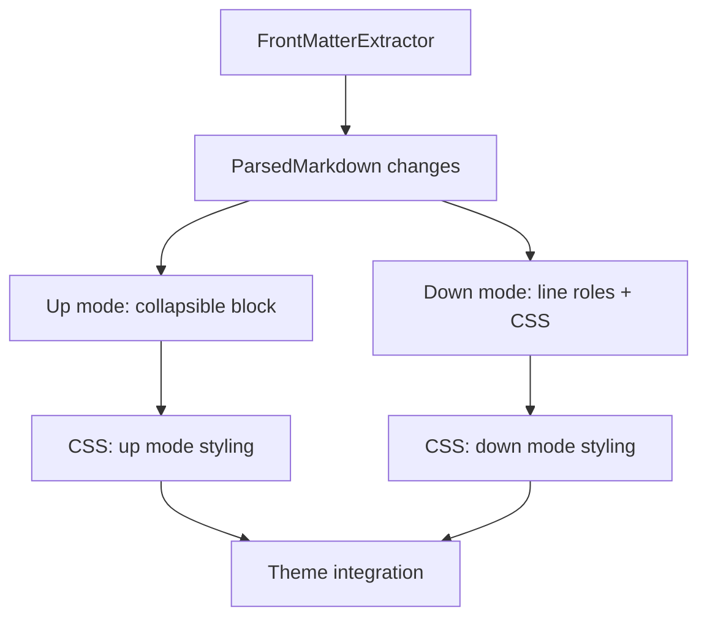

Plan: YAML Front-matter
===============================================================================

> Status: Planning

Addresses [joseph/mud#1](https://github.com/joseph/mud/issues/1). Markdown
files — especially those used with static site generators — often begin with a
YAML front-matter block. Currently Mud renders this as garbled inline text: the
`---` delimiters become thematic breaks, and the YAML key-value pairs become
paragraphs.


## Identifying front-matter

YAML front-matter follows a well-established convention (Jekyll, Hugo, Astro,
Obsidian, etc.):

1. The document **must start** with `---` at line 1, column 1 (no leading
   whitespace, BOM, or blank lines).
2. The opening `---` is followed by a newline.
3. A closing delimiter (`---` or `...`) appears on its own line.
4. Everything between the delimiters is the front-matter content.

The opening-line-1 requirement is what distinguishes front-matter from a
thematic break (`---` used later in the document). This is the same heuristic
used by GitHub, VS Code, Obsidian, and Pandoc.


### Edge cases

| Case                           | Handling                                                                 |
| ------------------------------ | ------------------------------------------------------------------------ |
| `---\n---` (empty)             | Valid; empty front-matter                                                |
| `---` with trailing whitespace | Accept (trim before matching)                                            |
| `...` as closing delimiter     | Accept (YAML spec allows this)                                           |
| No closing delimiter found     | Not front-matter; parse as normal                                        |
| Malformed YAML content         | Still treat as front-matter (we display, don't interpret)                |
| Windows line endings (`\r\n`)  | Handle (normalize or match `\r?\n`)                                      |
| BOM at start of file           | Strip before checking                                                    |
| Nested `---` inside YAML       | Not possible in valid YAML; the first `---`/`...` on its own line closes |


## Presentation

### Up mode (rendered view)

Render front-matter as a **collapsible metadata table**, collapsed by default:

```html
<details class="mud-frontmatter">
  <summary>Front Matter</summary>
  <table class="mud-frontmatter-table">
    <tr><td class="fm-key">title</td><td>My Document</td></tr>
    <tr><td class="fm-key">author</td><td>Jane Doe</td></tr>
    <tr><td class="fm-key">tags</td><td>swift, markdown, preview</td></tr>
    <tr><td class="fm-key">config</td><td><pre>nested:
  key: value</pre></td></tr>
  </table>
</details>
```

- Always starts collapsed — front-matter is metadata, not content. No state
  persistence.

- Top-level YAML keys are parsed with a lightweight string parser (no YAML
  library dependency). Values are rendered by type:

  - **Scalars** — plain text.
  - **Inline arrays** (`[a, b, c]`) — comma-separated text.
  - **Block arrays / nested objects** — small `<pre>` within the cell,
    preserving the raw YAML.

- Styled distinctly from content: subtle background, compact font, top-of-page
  position before the first heading.

- Falls back to a raw `<pre><code>` block if parsing produces no keys (eg, the
  front-matter is a bare scalar or entirely comments).


### Down mode (syntax-highlighted source)

The raw source is always fully visible in Down mode. Front-matter looks like a
YAML code block fenced with `---` instead of backticks:

- **Line roles:** `.fm-fence` for the `---` delimiters, `.fm-code` for YAML
  content lines — mirroring the existing `.dc-fence` / `.dc-code` pattern for
  fenced code blocks.
- **True YAML syntax highlighting** via
  `CodeHighlighter.highlight(yaml, language: "yaml")`. This runs highlight.js
  server-side (already used for fenced code blocks in Down mode) and produces
  `hljs-*` span classes. The highlighted HTML is split into lines and used as
  line content in the front-matter region.
- A subtle background tint or left-border to visually separate the block from
  the Markdown body — consistent with how fenced code blocks are styled.
- No Markdown syntax highlighting applied — the `---` delimiters are not
  colored as thematic breaks.


## Architecture

### New file: `Core/Sources/Core/FrontMatterExtractor.swift`

Two responsibilities:

**1. Detection and extraction:**

```
FrontMatterExtractor.extract(from: String)
    → (yaml: String, bodyStartLine: Int)?
```

Returns `nil` if no front-matter is detected. `yaml` is the raw content between
delimiters (without the `---` lines). `bodyStartLine` is the 1-indexed line
where the Markdown body begins (used by Down mode for line role assignment).

Detection is pure string scanning — no dependencies.

**2. Lightweight top-level key parsing (for table rendering):**

```
FrontMatterExtractor.parseTopLevelKeys(_ yaml: String)
    → [(key: String, value: FrontMatterValue)]
```

Where `FrontMatterValue` is an enum:

```swift
enum FrontMatterValue {
    case scalar(String)         // title: My Document
    case inlineArray([String])  // tags: [swift, markdown]
    case block(String)          // nested/block content (raw YAML)
}
```

Parsing rules:

- A line starting with a non-whitespace character followed by `:` begins a new
  top-level key.
- Continuation lines (indented) belong to the previous key.
- Inline `[...]` values → `.inlineArray` (split on `,`, trim each element).
- Single-line values → `.scalar`.
- Multi-line values (including block arrays `- item` and nested mappings) →
  `.block` with the raw indented text preserved.
- Comment-only lines (`# ...`) between keys are skipped.
- Quoted values (`"..."`, `'...'`) are displayed verbatim — no quote stripping.
- If parsing produces zero keys, the caller falls back to a raw code block.


### Changes to `ParsedMarkdown`

Add two stored properties:

- `frontMatter: String?` — the raw YAML content (without delimiters), or `nil`.
- `body: String` — the Markdown content after front-matter has been stripped.
  If no front-matter, this equals `markdown`.

The AST (`document`) is parsed from `body`, not `markdown`. This means the AST
is clean — no garbage thematic breaks or paragraphs from the YAML content.

`markdown` continues to store the full original string (needed for Down mode
rendering and for content-identity hashing).


### Changes to Up mode rendering (`MudCore.renderUpToHTML`)

After rendering the AST body via `UpHTMLVisitor`, check `parsed.frontMatter`.
If present, **prepend** the collapsible table HTML to the result:

1. Call `FrontMatterExtractor.parseTopLevelKeys()` on the raw YAML.
2. If keys are returned, build a `<details>` with a `<table>` inside — one row
   per key, value rendered according to its `FrontMatterValue` case.
3. If no keys are returned (bare scalar, all comments, etc.), fall back to a
   `<pre><code class="language-yaml">` block inside the `<details>`.

This rendering logic lives in a small helper (e.g., a static method on
`FrontMatterExtractor` or a private function in `MudCore`) — not in
`UpHTMLVisitor`.

No changes to `UpHTMLVisitor` itself — it already receives a clean AST.


### Changes to Down mode rendering

The Down mode pipeline needs to know which source lines are front-matter so it
can assign them a different line role. Two approaches:

**Option A — offset approach:** Parse `body` through the AST, offset all event
line numbers by `frontMatterLineCount`, and add front-matter lines with a
`.frontmatter` role in `buildLayout`. Requires threading an offset through the
event collector.

**Option B — split-and-combine approach:** Render front-matter lines separately
(simple HTML-escaped text with `.frontmatter` CSS classes), render body lines
via the existing pipeline, and combine in `buildLayout`.

I favor **Option B** — it keeps the existing AST-to-line pipeline untouched and
avoids off-by-one risks with line offsets. The front-matter lines are simple
enough that they don't need AST-driven highlighting.

Concretely:

- `DownHTMLVisitor.highlight()` gains a `frontMatterLineCount: Int` parameter
  (default 0).
- `buildLayout()` prepends that many lines with the `.fm-fence` / `.fm-content`
  roles before the body lines.
- The raw front-matter text is passed alongside for content.


### CSS changes

**`mud-up.css` :**

```css
.mud-frontmatter { /* collapsible container */ }
.mud-frontmatter summary { /* "Front Matter" label */ }
.mud-frontmatter pre { /* code block styling */ }
```

**`mud-down.css` :**

```css
.fm-fence .lc { /* delimiter lines (---) */ }
.fm-content .lc { /* YAML content lines */ }
```

Theme files may include front-matter-specific color overrides.


### Change tracking (deferred)

Front-matter is stripped before AST parsing, so `BlockMatcher` won't see it.
For now, front-matter changes won't appear in the changes sidebar or floating
bar. This is acceptable for a first pass — the rendered output will update
correctly on file change.

A future iteration can add front-matter as a synthetic block in the diff
system.


## Scope and sequence



1. `FrontMatterExtractor` — pure string logic, easily unit-testable.
2. `ParsedMarkdown` — add `frontMatter` and `body`, parse from `body`.
3. Up mode — prepend collapsible table in `renderUpToHTML`.
4. Down mode — pass front-matter line count, add line roles in layout.
5. CSS — style both modes, integrate with themes.

No changes needed to: `UpHTMLVisitor`, `HeadingExtractor`, `SlugGenerator`,
`AlertDetector`, `HTMLTemplate`, JS bridge, or the App layer.


## Testing

New test file: `Core/Tests/Core/FrontMatterExtractorTests.swift`.


### Detection and extraction

- Standard front-matter (`---\nkey: val\n---\n`) → extracts YAML, correct
  `bodyStartLine`.
- Empty front-matter (`---\n---\n`) → returns empty string, not `nil`.
- Closing with `...` → extracts correctly.
- No closing delimiter → returns `nil` (not front-matter).
- `---` not on line 1 (preceded by blank line or text) → returns `nil`.
- `---` with trailing whitespace on opening/closing lines → accepted.
- Windows line endings (`\r\n`) → handled correctly.
- Document with no front-matter → returns `nil`, body equals input.
- Front-matter only (no body after closing delimiter) → valid, empty body.


### Top-level key parsing

- Simple `key: value` pairs → `.scalar` with correct key and value strings.
- Inline array `tags: [a, b, c]` → `.inlineArray(["a", "b", "c"])`.
- Block array (`- item` on indented lines) → `.block` with raw text.
- Nested mapping (indented key-value lines) → `.block` with raw text.
- Multi-line scalar (`|` or `>` indicator) → `.block` with raw text.
- Quoted values (`"..."`, `'...'`) → `.scalar` with quotes preserved.
- Comment-only lines between keys → skipped, not included in any value.
- All-comment input → returns empty array (triggers code-block fallback).
- Empty input → returns empty array.


### Integration with `ParsedMarkdown`

Add cases to `ParsedMarkdownTests.swift`:

- Document with front-matter → `frontMatter` is populated, `body` excludes it,
  `title` extracted from first heading in body (not YAML `title` key).
- Document without front-matter → `frontMatter` is `nil`, `body` equals
  `markdown`.
- Headings and heading count are unaffected by front-matter presence.


### Rendering

Add cases to `MudCoreRenderingTests.swift` and/or `DownHTMLVisitorTests.swift`:

- Up mode with front-matter → output contains `mud-frontmatter` details
  element, table rows for keys, body content rendered normally.
- Up mode without front-matter → no `mud-frontmatter` element.
- Up mode fallback → when parsing yields no keys, output contains `<pre><code>`
  instead of `<table>`.
- Down mode with front-matter → front-matter lines have `fm-fence` / `fm-code`
  classes, body lines have normal `dl` classes, line numbers are continuous.
- Down mode without front-matter → output unchanged.
