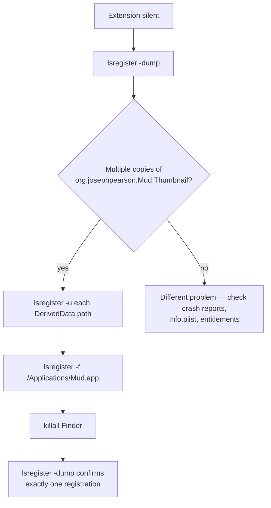

Plan: Document Icons and Thumbnails
===============================================================================

> Status: Complete.

## Goal

Give `.md` / `.markdown` files a distinctive Mud identity in Finder:

1. **Static document icon** — bundled card with Mud's muddy-drip motif, shown
   whenever Mud is the registered handler.
2. **Dynamic thumbnail** — same card but with the file's first heading drawn as
   the subject text. Used in Finder column, gallery, and large-icon views;
   falls back to the static icon below `QLThumbnailMinimumDimension`.

## What shipped

- Static icon: `App/Resources/MarkdownDocument.icns`, rasterized from
  `Thumbnail/Resources/thumbnail-static.svg` via
  `.claude/tmp/build-document-icon` into the ten Apple iconset slots.
- Thumbnail extension: `Thumbnail.appex` bundled under
  `Mud.app/Contents/PlugIns/`. Fills a 3:4 portrait canvas flat, draws the
  heading with `CTFramesetter`, composites `thumbnail-dynamic.png` (muddy drip
  \+ droplet, transparent top and sides) on top. Sandboxed, no network, no
  app-group.

See `Doc/AGENTS.md` for the current file reference and
`Thumbnail/ThumbnailProvider.swift` for the drawing code.

## Key design decisions

- **Legacy `CFBundleTypeIconFile` + `.icns`** for the static icon. The modern
  `UTTypeIcons` path draws a generic card with fold + shadow but strips our
  drip — the design signature. Legacy is not deprecated in Tahoe.
- **Separate `QLThumbnailProvider.appex`** for the dynamic thumbnail — cannot
  piggyback on the existing `QLPreviewingController` extension.
- **3:4 portrait reply aspect** so Finder's mandatory paper-sheet chrome (white
  rect + drop shadow around every `QLThumbnailProvider` reply, no documented
  opt-out) reads as a document page instead of a square card. The extension
  fills the canvas flat with `#E6E6E6` and lets Finder supply the page edge and
  shadow.
- **No theme awareness.** Thumbnails keep the fixed Earthy palette regardless
  of the user's active theme; per-machine variation would read as inconsistency
  at Finder scale.
- **Icon Composer / `.icon` bundles** don't apply to document icons as of
  Tahoe; document chrome was not part of the Liquid Glass redesign.

## Gotcha 1: Tahoe ExtensionKit routing

On Tahoe, `com.apple.quicklook.thumbnail` advertises
`EXRequiresLegacyInfrastructure = 0`, which tempts you to add
`EXAppExtensionAttributes` and match Apple's system-shipped thumbnail
extensions. **Don't** — the ExtensionKit dispatcher treats that block as a
claim that the bundle is a real ExtensionKit extension (product type
`com.apple.product-type.extensionkit-extension`, installed under
`Contents/Extensions/`), and an NSExtension-form `.appex` that adopts it gets
routed out of the legacy `pluginkit` registry entirely — silent failure.

Stay on the plain legacy pattern: bundle in `Contents/PlugIns/`,
`NSExtension`-only plist, `NSExtensionPrincipalClass`, no
`EXAppExtensionAttributes`. The extension point's
`EXSupportsNSExtensionPlistKeys = 1` is the compatibility shim that makes this
work.

The secure variant `com.apple.quicklook.thumbnail.secure` is
`EXExtensionPointIsPublic = 0` and reserved for Apple's own extensions.

## Gotcha 2: Duplicate registrations cause silent non-firing

**Symptom**: extension stops firing after a rebuild. No log output, no crash
report, `qlmanage -t` produces nothing. The bundle on disk looks correct.
`lsregister -f /Applications/Mud.app` does not help.

**Cause**: `lsregister -dump` lists multiple registrations for the same
`org.josephpearson.Mud.Thumbnail` identifier — `/Applications/Mud.app` plus one
or two Xcode DerivedData copies (`Build/Products/Debug-Direct/…` from Run,
`Build/Intermediates.noindex/ArchiveIntermediates/…/InstallationBuildProductsLocation/…`
from Archive). Every Xcode build re-registers its output path.

**Duplication alone breaks dispatch.** Verified empirically: two registrations
pointing at the same universal binary (identical Mach-O UUIDs, identical
entitlements, identical plist) still silenced the extension. LaunchServices
routes requests into the void when more than one registration exists for a
plugin identifier — it is not a stale-binary issue, not a Debug-vs-Release
mismatch, just the duplication.

**Fix**:

Unregister each DerivedData path (`lsregister -u "<path>/Mud.app"`),
re-register `/Applications/Mud.app` with `-f`, and `killall Finder`. Re-run
`lsregister -dump | grep -B 2 -A 30 MudThumbnail` to confirm only one entry.

**Diagnostic signal**: each registration has a `reg date:` line. Multiple
recent `reg date`s across different paths _is_ the bug. `pluginkit` output is
not diagnostic here — only `lsregister -dump` surfaces the conflict.

**Prevention**: there's no way to stop Xcode re-registering its output paths,
so re-run this sequence after any Xcode build that produced a new `.app` before
testing Finder thumbnails again.

## Follow-ups

- **Small-size wordmark.** `thumbnail-static.svg` bakes a single "MUD" wordmark
  sized for the 1024 canvas; it's unreadable at 16/32 px. The original plan
  called for size-varied text (large/medium/small) picked per slot; deferred.
  Revisit if small icons feel illegible in practice.
