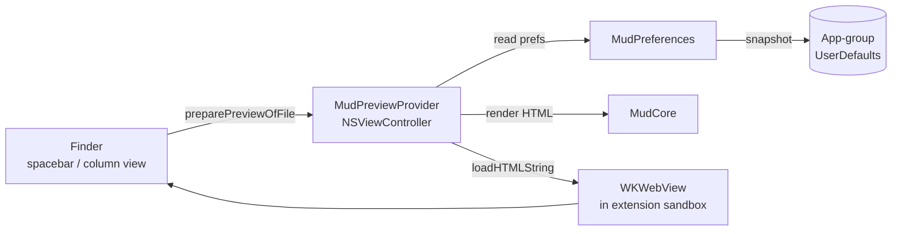

Plan: Quick Look Extension
===============================================================================

> Status: Complete

A macOS Quick Look extension so Finder previews of Markdown files render Mud's
Mark Up output. Ships as `MudQuickLook.appex` bundled inside
`Mud.app/Contents/PlugIns/`.


## What shipped

- Spacebar Quick Look preview of `.md` files: live rendered Mud output with the
  user's active theme, view toggles, zoom, and render extensions.
- Column-view preview pane: same rendering, live, scrollable, reflows on column
  resize.
- Local and remote images inlined in previews.
- Preferences flow from the main app via an app-group `UserDefaults` suite.
- No TCC prompt on first preview.


## Goals

- Preview `.md` in Finder with Mud's rendered output — **done**
- Reuse MudCore, no separate rendering path — **done**
- Preview-relevant preferences follow the main app (theme, zoom, view toggles,
  allow-remote-content, enabled extensions, DocC alert mode) — **done**


## Non-goals

- Mode toggle (Mark Up / Mark Down). The app does that.
- Custom chrome — buttons, tabs, sidebar.
- Live settings updates while the preview is open.
- Find, outline, change tracking, anything interactive.
- Honoring the app's lighting override (bright/dark). The rendered HTML only
  expresses `@media (prefers-color-scheme: dark)`, and the app's bright/dark
  override is applied via `NSAppearance` on the window — a knob Quick Look
  doesn't give us. Previews follow system lighting. Revisit if/when MudCore
  gains a class-based lighting override.
- **External link opening.** Clicks on `http(s)` and `file` links in a preview
  do nothing — the navigation is cancelled by a `WKNavigationDelegate`. See
  "Link handling" below for why. Anchor scrolls inside the preview still work.
- **Thumbnail provider (`QLThumbnailProvider` ).** Would render Mud-styled
  thumbnails in Finder icons, Gallery view's large pane, Spotlight results, and
  AirDrop. Deliberately skipped: Finder requests thumbnails eagerly for every
  visible file when opening a folder, and a WKWebView-per-file rendering pass
  (the natural sharing path with the preview extension) would stall on folders
  with many Markdown files. The alternative — a separate cheap text-thumbnail
  drawer — would diverge visually from the preview and still adds complexity.
  Accepted trade-off: `.md` files show the system's default text-document icon
  in the places where thumbnails are displayed. The preview extension covers
  every place a user actually _reads_ a preview (spacebar, column-view pane).


## Final architecture

The extension is a view-based Quick Look extension: an `NSViewController`
conforming to `QLPreviewingController` that hosts a `WKWebView`. Same rendering
path as the main app — MudCore produces an HTML document, which is loaded into
the WebView via `loadHTMLString(_:baseURL:)`.



View-based was chosen over data-based (`QLPreviewProvider` with
`QLIsDataBasedPreview = true`) because Finder's **column-view preview pane does
not invoke data-based preview extensions**. Data-based extensions only fire for
the spacebar window; the column-view pane prefers an embeddable
`NSViewController`. The view-based path covers both contexts with one
implementation.

Key files:

- `QuickLook/PreviewProvider.swift` — `MudPreviewProvider`
- `QuickLook/Info.plist`
- `QuickLook/QuickLook.entitlements`


## The hard lessons

Three separate bugs consumed the majority of the debugging time. Recording them
here so the next person (or the next agent) doesn't rediscover them.


### 1. MacVim's UTI pollution

For hours the extension registered cleanly but was never invoked. Finder
rendered plain text; the log stream showed Apple's built-in
`QLPreviewGenerationExtension` plus `com.apple.qldisplay.Text` winning the
selection every time. Neither a `QLPreviewProvider` subclass nor a
`QLPreviewingController` subclass overcame it. Installed third-party previewers
also failed.

Root cause: **MacVim** had been installed and was declaring `UTExportedType`
ownership of `net.daringfireball.markdown` in its Info.plist, with a
conformance override pinning the UTI as `public.plain-text`. Because exports
win over imports in LaunchServices, MacVim's (incorrect) ownership claim
overrode the real UTI conformance chain, and Quick Look routed `.md` straight
to the plain-text display bundle — bypassing every previewer, Apple's own
included.

If future debugging shows the same pattern (extension registered, log stream
shows `QLPreviewGenerationExtension` + `com.apple.qldisplay.Text` always
winning, and _other_ known-working `.md` previewers also fail), dump
`lsregister` and look for rogue exporters of the UTI.


### 2. `NSExtensionPrincipalClass` and Swift module-name mangling

Once the UTI route was clear, the extension's `init` fired but `providePreview`
never did. The principal class pointed at
`$(PRODUCT_MODULE_NAME).PreviewProvider`, which should have expanded to the
Swift class's mangled Obj-C name — but the runtime resolution was failing
silently and Quick Look was instantiating a base `QLPreviewProvider` that did
nothing.

Fix: annotate the class with `@objc(MudPreviewProvider)` and reference it by
the bare Obj-C name in `Info.plist`:

```xml
<key>NSExtensionPrincipalClass</key>
<string>MudPreviewProvider</string>
```

This sidesteps `PRODUCT_MODULE_NAME` expansion entirely. The pattern matches
what working extensions in the wild do. Use it for every extension class in
this project going forward.


### 3. Team-ID-prefixed app group (the "access data from other apps" prompt)

On first preview the user saw a TCC prompt: "Mud.app would like to access data
from other apps." This is macOS Sequoia's Group Container Protection, not a
Tahoe-specific change. An app accesses a group container silently only when
**one** of these is true:

1. Distributed via the Mac App Store.
2. Group identifier is prefixed with the Team ID.
3. Group identifier is authorized by an embedded provisioning profile (Catalyst
   / iOS pattern).

Our plain `group.org.josephpearson.mud` satisfied none of these for a
Developer-ID-signed build, so Sequoia/Tahoe prompted the user on every fresh
install.

Fix: rename the app group to `$(TeamIdentifierPrefix)org.josephpearson.mud`
(Xcode expands at sign time) in all three entitlements files. In Swift,
`MudPreferences.appGroupSuiteName` reads the resolved group at runtime via
`SecTaskCopyValueForEntitlement`, with the literal string
`"XVL2AFNXH5.org.josephpearson.mud"` as a hard fallback for unsigned test
processes. Single source of truth is the entitlements file; the hardcoded
string is only reached when Security-framework lookup fails.


## Image handling

Local images are inlined as base64 data URIs via `ImageDataURI.encode`, the
same path the CLI's `--browser` mode uses. Remote images are left as
`` and loaded by the WebView at display time, gated by the
extension's `network.client` entitlement and the content's CSP.

We tried dropping `ImageDataURI` and relying on
`WKWebView.loadHTMLString(_: baseURL:)` to resolve relative paths against the
document's parent directory. It doesn't work: WKWebView blocks `file://`
subresources when the HTML is provided as a string, regardless of sandbox
grants. The canonical escape hatch (`loadFileURL(_:allowingReadAccessTo:)`)
would require writing an HTML temp file per preview, which we'd rather avoid.
Inlining stays.


## Link handling

The preview is read-only: `MudPreviewProvider` sets itself as the webview's
`WKNavigationDelegate` and cancels every navigation except the initial HTML
load and same-document fragment scrolls. Link clicks are effectively silent.

Routing outbound clicks to the default browser or the registered app isn't
possible from a QL preview extension. What we tried and what sandboxd said:

- `NSWorkspace.shared.open(_:)` returns `false`. Console shows sandboxd denying
  the call: `operation: "lsopen", action: "deny"`, with a stack trace
  originating from `-[NSWorkspace openURL:]`.
- `extensionContext.open(_:completionHandler:)` calls back with
  `success == false`; under the hood `EXExtensionContextImplementation`
  forwards to the same LaunchServices `lsopen` path and is denied identically.
- QL preview extensions must carry `com.apple.security.app-sandbox` — the
  system refuses to load an unsandboxed `.appex` at the
  `com.apple.quicklook.preview` extension point. Dropping the sandbox isn't an
  option even for Direct builds.
- No `temporary-exception` entitlement covers `lsopen`. The sandbox profile
  baked into the extension loader denies the operation unconditionally.

The only workable bypass is IPC to a running main-app process — distributed
notifications or an XPC service hosted by Mud.app — that performs the open from
the unsandboxed context. Rejected: it works only when Mud.app is already
running, fails silently otherwise, and adds fragile cross-process state for a
secondary UX.

Allowing in-place navigation is technically possible (the extension holds
`network.client`, so the webview can load `https://…` URLs), but turns the
preview pane into a crippled browser with no back button, no tabs, and no way
back to the Markdown render. Not worth the trade.


## Entitlements

The extension is sandboxed. The extension follows the main app's pattern of
separate entitlements files for Mac App Store and Direct distribution:

- `QuickLook/QuickLook.entitlements` — MAS build. Minimum viable set.
- `QuickLook/QuickLookDirect.entitlements` — Direct build. Adds a
  temporary-exception so `ImageDataURI.encode` can read sibling image files
  when the markdown document references them. MAS builds omit this entitlement
  because App Review is historically cool on `temporary- exception` entries,
  and Mud is already in the store signed without any.

Common entries in both files:

- `com.apple.security.app-sandbox` — required for Quick Look extensions.
- `com.apple.security.network.client` — so the WebView in our sandbox can fetch
  remote images. (Not needed in the briefly-lived data-based variant, because
  Finder's renderer held the network grant; needed now that the WebView is
  ours.)
- `com.apple.security.application-groups` =
  `[$(TeamIdentifierPrefix)org.josephpearson.mud]` — for the preferences
  snapshot.

Direct-only entry:

- `com.apple.security.temporary-exception.files.absolute-path.read-only` =
  `["/"]` — so `ImageDataURI.encode` can read sibling image files. Quick Look
  grants access to the previewed file, not to its siblings. The temp-exception
  is the simplest workable path; a narrower grant isn't available.

Consequence: local-image references in a `.md` preview render broken in MAS
builds and inline correctly in Direct builds. Remote images work in both.
Accepted trade-off — Direct is the channel where power users live, and MAS
reviewability matters more than perfect image coverage there.


## Settings via app group

Extensions can't read the main app's `UserDefaults` directly. The shared
preference layer is described in
[2026-04-mud-configuration.md](./2026-04-mud-configuration.md). The QL
extension consumes one piece of it: `MudPreferences.snapshot()`, a value type
containing every field that flows into `RenderOptions` for an Up-mode preview.

Edge case: if a user installs the upgrade and triggers a Quick Look preview
_before_ launching the main app, migration has not yet run, the suite is empty,
and the snapshot returns hard-coded defaults. Accepted trade-off on the basis
that users typically launch the app once after installing. If the preview looks
wrong on first use, launching the app fixes it.

If a user changes theme while a preview is open, the next preview picks up the
change; the current one does not (live updates are a non-goal).


## UTI declarations

The extension declares `net.daringfireball.markdown` as its only supported
content type. `public.markdown` is not a real UTI. The main app already imports
`net.daringfireball.markdown` in `App/Info.plist`, so no change there.


## Distribution

Mud ships through both channels today:

- **Mac App Store** — sandboxed main app. The extension bundles the same way.
  Both targets carry the app-group entitlement, both signed by the same team.
  The Team-ID prefix on the group identifier isn't strictly required for MAS
  builds (MAS provisioning authorizes group membership) but having it present
  is harmless and keeps parity with the Direct build. See the Entitlements
  section above for the temp-exception wrinkle that still needs resolving
  before the first MAS submission to include this extension.
- **Direct distribution** — same bundle. Extension is sandboxed; main app is
  not. The main app carries the app-group entitlement so its non-sandboxed
  process can still write to the group container.


## Testing

`qlmanage` is a poor fit for modern QL extensions. It predates the
app-extension model, and since Sequoia its `-m` listing can't see third-party
`.appex` extensions at all — only legacy, now-deprecated `qlgenerator` bundles.
Don't build the test loop on it.

The reliable loop is Finder + logs + a debugger attach:

1. Copy `Mud.app` into `/Applications` and launch it once so LaunchServices
   registers the bundled `.appex`.

2. `qlmanage -r && killall Finder` between changes to clear stale state.

3. Spacebar-preview a fixture in Finder, and also select it in column view with
   the preview pane visible — both paths are live.

4. In a second terminal, stream logs for the QL subsystem and the extension
   bundle ID:

   ```
     log stream --predicate \
       'subsystem == "com.apple.quicklook" \
        || subsystem == "org.josephpearson.Mud.QuickLook"'
   ```

5. For breakpoints and stepping, attach Xcode to the running
   `com.apple.quicklook.ui.extension.Preview` process and trigger a preview.

Fixtures worth keeping under `Tests/QuickLookFixtures/`:

- `plain.md` — text-only, sanity-check the fast path
- `relative-images.md` — sibling, subdirectory, and parent-directory image
  references — exercises the sandbox temp-exception
- `remote-images.md` — verifies the CSP and `blockRemoteContent` wiring
- `mermaid.md` — confirms the standalone JS path survives inside QL's WebView
- `first-preview.md` — preview-before-launch case where the app-group suite is
  empty; output should use hard-coded defaults without crashing
