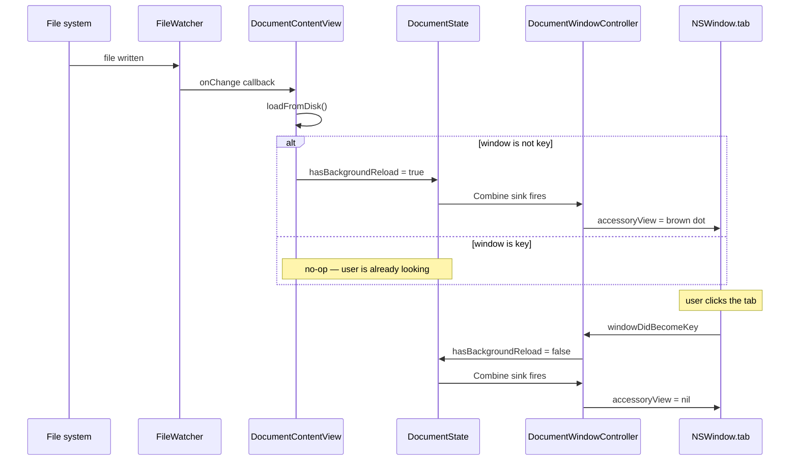

Plan: Tab Reload Badge
===============================================================================

> Status: Complete

## Context

Mud auto-reloads a document whenever its file changes on disk. In a tabbed
window group, a reload of a background tab happened silently — the user had no
way to tell, without clicking through each tab, which documents had picked up
fresh content since they last looked. This was a common friction point when
editing in a terminal editor and using Mud as a side-by-side preview across
several files.

The fix is a subtle, Apple-native indicator: a medium-brown dot on the tab
itself whenever that tab's document has reloaded while the window wasn't the
key window. The dot clears the moment the tab becomes key. This mirrors the
Safari / Terminal convention of "tab has activity you haven't seen yet" without
introducing any custom tab-bar UI.

## Approach

The dot is rendered via `NSWindowTab.accessoryView` — the same Apple-sanctioned
hook Safari uses for its per-tab speaker icon. A tiny `NSView` sits beside the
tab's title, travels with the tab through drag / reorder / close, and simply
isn't visible when the window isn't in a tab group.

A published boolean on `DocumentState` (`hasBackgroundReload`) drives the
accessory view from `DocumentWindowController` via a Combine sink. When the
flag flips on, the sink attaches a fresh `TabReloadBadgeView`; when it flips
off, it assigns `nil`.

## Change flow

## Summary of changes

- **`App/DocumentState.swift`** — added a published `hasBackgroundReload`
  boolean and a weak `windowController` back-reference so per-window code can
  ask its window whether it's currently key.

- **`App/DocumentContentView.swift`** — the `FileWatcher` callback in
  `setupFileWatcher()` now flips `state.hasBackgroundReload` to `true` after
  reloading from disk if the owning window isn't key at that moment. The
  initial `.onAppear → loadFromDisk()` path and the Cmd-R path are unaffected
  because neither goes through the watcher closure.

- **`App/TabReloadBadgeView.swift`** (new) — a small custom `NSView` drawing a
  filled circle in a dynamic brown color (saddle-brown `#8B5A2B` in light
  appearance, tan `#D9B87C` in dark appearance). The view is a few pixels wider
  than the dot itself so it leaves trailing padding inside the tab, and a pixel
  taller than the dot so the dot keeps its 1 px inset top and bottom. The color
  is resolved per-appearance via `NSColor(name:dynamicProvider:)`, and
  `viewDidChangeEffectiveAppearance` triggers a redraw on appearance change.

- **`App/DocumentWindowController.swift`** — populates
  `state.windowController = self` right after `super.init`; adds a Combine sink
  in `observeState()` that calls a new `updateTabReloadBadge(_:)` helper on
  every change of `state.$hasBackgroundReload`; the helper attaches or clears
  the `TabReloadBadgeView` on `window.tab.accessoryView`; `windowDidBecomeKey`
  now also sets `state.hasBackgroundReload = false` so the dot disappears the
  moment the user focuses the tab.

- **`Mud.xcodeproj/project.pbxproj`** — registered `TabReloadBadgeView.swift`
  as a source file on the Mud app target (PBXBuildFile, PBXFileReference, the
  App group listing, and the Sources build phase).

- **`Doc/AGENTS.md`** — added `TabReloadBadgeView.swift` to the App/ key-file
  reference.

## Behaviour details

- **Multiple background reloads between activations collapse into one dot.**
  Re-assigning `hasBackgroundReload = true` while it's already `true` is a
  no-op as far as the user can see.

- **Manual reload (Cmd-R) does not badge.** The reload triggered by
  `state.reloadID` runs `loadFromDisk()` directly rather than via the
  `FileWatcher` closure, so the badge logic doesn't fire. That's the intended
  behaviour — the user initiated the reload, so there's nothing to announce.

- **Lone window (no tab bar).** Setting `accessoryView` on a solo window's
  `tab` is harmless — there's no tab bar to show it on. No special-casing
  needed.

- **App in background.** When Mud is not the frontmost app, no window is key,
  so a reload during that time flips the flag on the affected tab. When the
  user returns to Mud and a window becomes key, `windowDidBecomeKey` clears its
  flag. Tabs the user didn't activate keep their dot until visited.

- **Tab drag between windows.** NSWindowTab travels with its window, and the
  accessoryView travels with the tab, so moving a tab into another window
  preserves the dot without extra work.

## Verification

Manual (the only meaningful test — all behaviour is AppKit UI):

1. Build and launch the app. Open two `.md` files so they merge into a tab
   group (File → New Tab, or drag windows together).
2. Confirm the foreground tab has **no** dot.
3. Switch to the first tab, then externally modify the second file (e.g.
   `echo "# edit" >> file2.md` in a terminal).
4. Confirm a medium-brown dot appears on the second tab within ~1 s, with a few
   pixels of padding between the dot and the right edge of the tab content.
5. Click the second tab — dot disappears immediately on activation.
6. Switch back to the first tab, modify `file2.md` again — dot reappears.
7. While the app is in the background (focus another app), modify one of the
   files. Bring Mud forward. Confirm the dot appears on whichever tab was not
   key.
8. With a single, non-tabbed window, modify its file from outside. Confirm no
   error and no visible artifact (dot is there but hidden because there's no
   tab bar).
9. Trigger Cmd-R on a background tab — confirm the dot does not appear (manual
   reload shouldn't count).
10. Dark mode: repeat steps 3–4 and confirm the dot uses the lighter tan tone.

## Out of scope

- Dot on the Dock icon / app badge. This is per-tab only.
- Count badges (e.g. "3 reloads since last seen"). A single dot is enough.
- Animation / pulsing. Static.
- Settings toggle to disable the feature. Revisit if it proves distracting.
