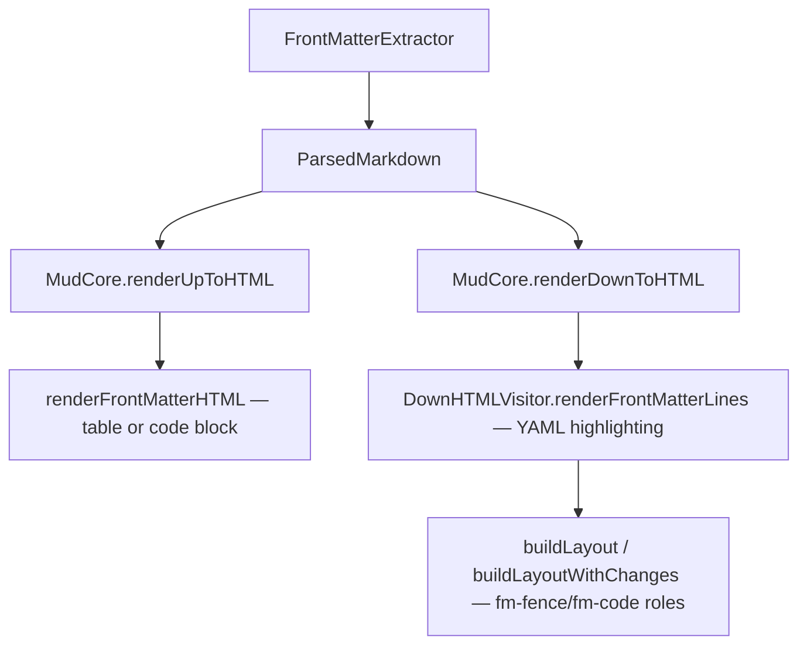

Plan: YAML Front-matter
===============================================================================

> Status: Complete

Addresses [joseph/mud#1](https://github.com/joseph/mud/issues/1). Markdown
files — especially those used with static site generators — often begin with a
YAML front-matter block. Previously Mud rendered this as garbled inline text:
the `---` delimiters became thematic breaks and the YAML key-value pairs became
paragraphs. Now Mud detects front-matter, strips it from the AST, and presents
it distinctly in both modes.

## Identifying front-matter

YAML front-matter follows a well-established convention (Jekyll, Hugo, Astro,
Obsidian, etc.):

1. The document **must start** with `---` at line 1, column 1 (no leading
   whitespace, BOM, or blank lines).
2. The opening `---` is followed by a newline.
3. A closing delimiter (`---` or `...`) appears on its own line.
4. Everything between the delimiters is the front-matter content.

The opening-line-1 requirement is what distinguishes front-matter from a
thematic break (`---` used later in the document). This is the same heuristic
used by GitHub, VS Code, Obsidian, and Pandoc.

Edge cases handled: empty front-matter, trailing whitespace on delimiters,
`...` as closing delimiter, Windows line endings (`\r\n` normalized to `\n`),
malformed YAML (displayed as-is), no closing delimiter (treated as normal
Markdown).

## Presentation

### Up mode

A collapsible `
` element, always starting collapsed. Top-level YAML
keys are parsed with a lightweight dependency-free string parser into a
key-value table. Value types:

- **Scalars** — plain text (quoted values displayed verbatim).
- **Inline arrays** (`[a, b, c]`) — comma-separated text.
- **Block values** (nested mappings, block arrays, literal/folded scalars) —
  small `<pre>` preserving the raw YAML.

Falls back to a syntax-highlighted `<pre><code>` block when parsing produces no
keys (e.g., all comments).

### Down mode

Front-matter appears as a YAML code block fenced with `---`: delimiter lines
get `.fm-fence` (dimmed, like `.dc-fence`), content lines get `.fm-code` with
true YAML syntax highlighting via `CodeHighlighter` (highlight.js server-side).
Line numbers are continuous across front-matter and body.

## Architecture

### `FrontMatterExtractor` (new)

Two responsibilities: (1) detection and extraction — returns the raw YAML, the
body string, and the front-matter line count; (2) lightweight top-level key
parsing via `parseTopLevelKeys()` returning `[KeyValue]` with a
`FrontMatterValue` enum (`.scalar`, `.inlineArray`, `.block`).

`\r\n` is normalized to `\n` before scanning.

### `ParsedMarkdown` (modified)

Added `frontMatter: String?`, `body: String`, and `frontMatterLineCount: Int`.
The AST is parsed from `body` (not `markdown`), so no garbage thematic breaks
or paragraphs leak through. `\r\n` normalization also happens here so all
downstream code receives clean input.

### Up mode rendering (modified)

`MudCore.renderUpToHTML` checks `parsed.frontMatter` and prepends collapsible
HTML via a private `renderFrontMatterHTML` helper. No changes to
`UpHTMLVisitor`.

### Down mode rendering (modified)

`MudCore.renderDownToHTML` calls `DownHTMLVisitor.renderFrontMatterLines()` to
produce YAML-highlighted HTML, then passes the pre-rendered array into
`highlight()` / `highlightWithChanges()`. The `buildLayout` methods prepend
front-matter lines with `fm-fence`/ `fm-code` roles (via a shared
`frontMatterRoles()` helper). A `LineRole.cssClass` computed property and
`isScrollable` flag eliminate switch-statement duplication.

### CSS

`mud-up.css` — `.mud-frontmatter` details container, `.mud-frontmatter-table`
key-value table, `.fm-key` column styling. `mud-down.css` — `.fm-fence` and
`.fm-code` with `--code-bg` background, fence lines dimmed to 0.5 opacity.

### Change tracking (deferred)

Front-matter is stripped before AST parsing, so `BlockMatcher` does not see it.
Front-matter changes will not appear in the changes sidebar. The rendered
output updates correctly on file change. A future iteration can add
front-matter as a synthetic block in the diff system.

### Files not changed

`UpHTMLVisitor`, `HeadingExtractor`, `SlugGenerator`, `AlertDetector`,
`HTMLTemplate`, JS bridge, App layer.

## Testing

`FrontMatterExtractorTests.swift` (new) — 22 tests covering detection (9) and
key parsing (13). `ParsedMarkdownTests.swift` — 5 new tests for `frontMatter`,
`body`, title extraction, and heading invariance. `MudCoreRenderingTests.swift`
— 7 new tests for Up mode (table, fallback, body rendering) and Down mode (line
roles, continuous line numbers). All passing.
