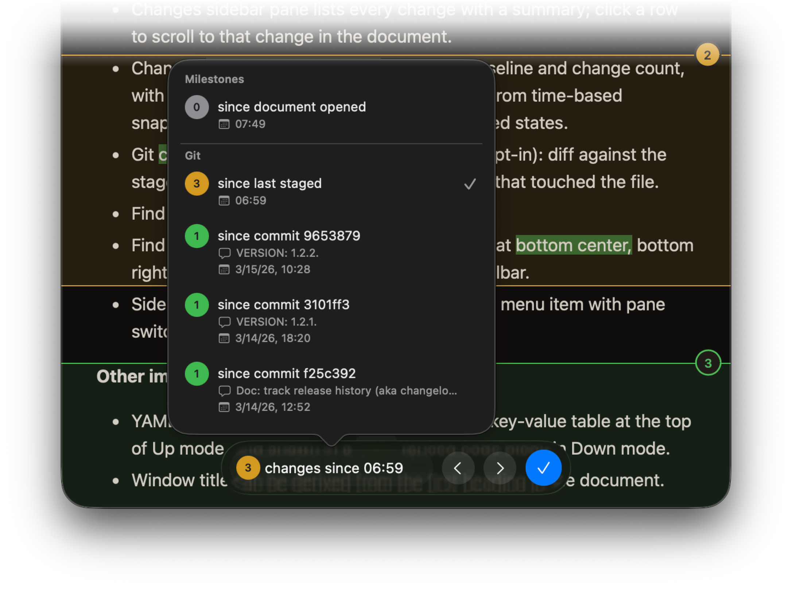

RELEASES
===============================================================================

## v2.1.0

- **Quick Look previews** — press Space on a Markdown file in the Finder to see
  it rendered with Mud's syntax highlighting, alerts, and themes. Also renders
  live in the column-view preview pane.
- **Document thumbnails** — Markdown files in the Finder show a portrait
  thumbnail featuring the file's first heading, so you can scan a directory at
  a glance.
- **Markdown document icon** — `.md` files carry a dedicated Mud icon when Mud
  is the default handler.
- **Background tab badge** — when a document reloads in a tab that isn't
  focused, a small brown dot marks the tab as having fresh content. The dot
  clears when you focus the tab.
- Preferences set by `defaults write …` now take effect without restarting the
  app. You can find a thorough guide to "setting preferences from the command
  line" in Help > HUMANS, including some hidden preferences.
- Word-level diff markers inside indented code blocks line up more
  accurately with the code they annotate.

> Tip: Did you know you can enable Git commits as change waypoints in Settings?

## v2.0.1

[The v2.0.0 release](https://apps.josephpearson.org/mud/releases/v2.0.0.html)
introduced a major feature: Change Tracking! This release adds a handful of
refinements:

- New **Auto-expand changes** setting expands deletion and mixed change groups
  by default, so you can see the full diff without clicking each one
- Exported HTML (Save as PDF, Open in Browser) no longer includes change
  tracking overlays and scripts
- Improved date formatting for older waypoints in the Changes controls
- Spotlight searches for "Markdown" and "GFM" now find Mud in results

## v2.0.0

This version introduces **change tracking**! Compare your document against
earlier reloads from the same Mud session. More:

- Change comparisons show highlighted insertions and deletions in both Up and
  Down modes.
- Word-level diffs show exactly what changed within each line.
- Up mode organizes changes into groups, and condenses consecutive red-delete +
  green-insert blocks into "orange-mix" groups. This makes it easy to see
  regions of change without the noise. Click the index circle for the change to
  expand it.
- Changes sidebar pane lists every change with a summary; click a row to scroll
  to that change in the document.
- Changes floating controls show the active baseline and change count, with a
  popover to switch baselines — choose from time-based snapshots,
  document-opened, or last-accepted states.
- Git commit comparisons (direct distribution, opt-in): diff against the staged
  version or any of the last five commits that touched the file.
- Find bar redesigned as a floating control bar.
- Find and Changes control bars can be floated at bottom center, bottom right,
  or top right. Toggle them via the app toolbar.
- Sidebar toggle consolidated into a single View menu item with pane switcher
  (Outline / Changes).

**Other improvements**:

- YAML frontmatter parsed into an expandable key-value table at the top of Up
  mode, and shown in a `---` fenced code block in Down mode.
- Window title can be derived from the first heading in the document.

**Screenshot of the Changes feature**:

## v1.2.2

- New `--standalone` CLI flag produces self-contained HTML on stdout with
  images embedded as data URIs and all scripts inlined — the same treatment as
  `--browser`, without opening a browser window
- Copy Code button no longer duplicates when hovering repeatedly over a code
  block

## v1.2.1

- Copy Code button appears on hover over fenced code blocks in Up mode
- Down mode layout restructured from HTML table to divs for better rendering
  and accessibility
- Mermaid diagram rendering is now optional, with a toggle in Up Mode settings
- New Markdown settings pane with DocC alert mode selector
- Auto-update support for direct distribution builds via Sparkle
- Release Notes link in the Help menu
- F3 and F4 as secondary keyboard shortcuts for sidebar and find
- Manual reload (Cmd+R) re-establishes the file watcher when the watched file
  has been replaced
- File watcher retries with backoff when re-establishing after external changes
- Local images served via `mud-asset:` are no longer cached, so edits to
  referenced images appear immediately on reload
- Settings labels use sentence case throughout
- Debugging pane in Settings (debug builds only) with preference reset

## v1.1.0

- Settings dialog with sidebar navigation and panes for General, Theme,
  Markdown, Up Mode, Down Mode, Command Line, and Debugging
- Theme preview cards in Settings with visual color swatches
- Card-based lighting selector in General settings
- Up Mode setting to block loading of remote content
- Sandbox-aware command line settings: manual `ln -s` instructions when
  sandboxed, automatic installer otherwise
- GFM alerts and DocC-style asides (Note, Tip, Important, Warning, Caution)
- Special "Status" aside with deep orange styling and pulse icon
- "Error" recognized as a DocC-style aside
- Emoji shortcode support in Up mode (`:shortcode:` → emoji)
- Mermaid diagram rendering in Up mode
- CLI tool: separate "Mud CLI" target for command-line HTML output
- CLI tool: `-v` reports the main Mud.app version number
- CLI tool: when sandboxed, strips executable assets and adapts settings pane
- Error page displayed when documents can't be opened
- Help menu item and bundled README opened on first launch
- Table of contents sidebar: extra space for disclosure chevrons, decoupled
  empty-state view from sidebar layout
- FileWatcher no longer fires onChange after genuine file deletion
- Window frame restored after content and toolbar setup
- "Enter Full Screen" hidden from View menu

## v1.0.0

- Initial release.
